<div align="center">
  
</div>
<br/>

**Type** _(TypeScript Yields Powerful [Game] Engines)_ - A modern TypeScript-based game engine built with Electron, React, and PIXI.js. This project implements Entity Component System (ECS) architecture with a sophisticated multi-engine design pattern for high-performance game development.

**Academic Context**: Final project for MBA in Software Engineering at USP Brazil 🎓🇧🇷

## 🎯 Project Overview

Type provides a complete game development ecosystem:

- **Lightweight Game Runtime**: PIXI.js-powered 2D rendering with physics simulation
- **ECS Architecture**: Entity Component System with modular sub-engines
- **Physics Integration**: Matter.js-powered physics simulation with automatic sprite synchronization
- **JSON-Based Projects**: Human-readable, version-control-friendly game data
- **Cross-Platform**: Electron-based desktop application framework

### Core Technologies

- **TypeScript**: Type-safe development with modern language features
- **Electron**: Cross-platform desktop application framework
- **React 19**: Modern UI library for desktop interface
- **PIXI.js 8**: High-performance 2D WebGL rendering
- **Matter.js**: 2D physics engine for realistic simulation
- **Vite**: Fast build tooling and development server
- **Vitest**: Comprehensive testing framework
- **Biome**: Code formatting and linting

## 🏗️ Architecture Overview

### Multi-Process Electron Structure

```mermaid
graph TB
    subgraph "Electron Application"
        MP["🔧 Main Process<br/>• App lifecycle<br/>• Window management<br/>• File system access<br/>• IPC coordination"]
        PS["🔒 Preload Script<br/>• Secure IPC bridge<br/>• Context isolation<br/>• API exposure"]
        
        subgraph "Renderer Processes"
            GR["🎮 Game Renderer<br/>• PIXI.js runtime<br/>• TypeEngine<br/>• JSON loading<br/>• Physics simulation"]
        end
    end
    
    MP <--> PS
    PS <--> GR
    MP <--> GR
```



### Engine Architecture

```mermaid
graph TB
    subgraph "TypeEngine - Main Coordinator"
        TE["🎛️ TypeEngine<br/>• Engine lifecycle<br/>• Scene coordination<br/>• Update loop<br/>• Dependency injection"]
    end
    
    subgraph "Sub-Engines"
        EE["👥 EntityEngine<br/>• Entity management<br/>• Component registration<br/>• Entity lifecycle"]
        RE["🖼️ RenderEngine<br/>• Sprite management<br/>• PIXI.js coordination<br/>• Visual rendering"]
        PE["⚡ PhysicsEngine<br/>• Matter.js integration<br/>• Body management<br/>• Physics simulation"]
        ScE["🎬 SceneEngine<br/>• Scene loading<br/>• Scene transitions<br/>• Asset coordination"]
        SysE["⚙️ SystemEngine<br/>• System management<br/>• Update coordination<br/>• System lifecycle"]
        EvE["📡 EventEngine<br/>• Event dispatching<br/>• Inter-engine communication<br/>• Event queuing"]
        TiE["⏰ TimeEngine<br/>• Frame timing<br/>• Delta calculation<br/>• Update scheduling"]
    end
    
    subgraph "Systems Layer"
        RS["🎨 RenderPixiSystem<br/>• Sprite rendering<br/>• Visual updates"]
        PS["🏃 PhysicsSystem<br/>• Physics updates<br/>• Collision detection"]
        MS["🖱️ MouseSystem<br/>• Input handling<br/>• Mouse events"]
    end
    
    subgraph "Components Layer"
        DC["🖼️ Drawable Components<br/>• SpriteComponent"]
        PC["⚡ Physics Components<br/>• RigidBodyRectangle<br/>• ColliderRectangle<br/>• SensorRectangle"]
        IC["🎯 Input Components<br/>• MouseComponent"]
    end
    
    TE --> EE
    TE --> RE
    TE --> PE
    TE --> ScE
    TE --> SysE
    TE --> EvE
    TE --> TiE
    
    SysE --> RS
    SysE --> PS
    SysE --> MS
    
    RS --> DC
    PS --> PC
    MS --> IC
```



### Data Flow Architecture

```mermaid
sequenceDiagram
    participant Project as 📁 __Project__ Files
    participant TypeEngine as 🎛️ TypeEngine
    participant Systems as ⚙️ Systems
    participant Components as 🔧 Components
    
    Project->>TypeEngine: Load game data
    TypeEngine->>Systems: Initialize systems
    Systems->>Components: Process components
    
    loop Game Loop
        TypeEngine->>Systems: Update (deltaTime)
        Systems->>Components: Transform data
        Components->>TypeEngine: State changes
    end
```



## 📁 Project Structure

```
src/
├── __Engine__/                 # 🎮 Game Engine Core
│   ├── TypeEngine.ts          # Main engine coordinator
│   ├── Engines/               # Sub-engine implementations
│   │   ├── Entity/           # Entity management
│   │   ├── Event/            # Event system
│   │   ├── Physics/          # Physics integration
│   │   ├── Render/           # Rendering management
│   │   ├── Scene/            # Scene management
│   │   ├── System/           # System coordination
│   │   └── Time/             # Time management
│   ├── Systems/              # Game logic systems
│   │   ├── Physics/          # Physics system
│   │   ├── Render/           # Rendering system
│   │   └── Input/            # Input systems
│   ├── Component/            # ECS components
│   │   ├── Drawable/         # Visual components
│   │   ├── Physics/          # Physics components
│   │   └── Input/            # Input components
│   └── Utils/                # Engine utilities
├── __Project__/              # 🧪 Test Game Assets
│   ├── *.scene.json         # Scene definitions
│   ├── *.blueprint.json     # Entity blueprints
│   ├── *.system.ts          # Game systems
│   ├── *.component.ts       # Game components
│   └── assets/              # Game assets
├── main/                     # 🔧 Electron Main Process
├── preload/                  # 🔒 Secure IPC Bridge
└── renderer/
    └── game/                # 🎮 PIXI.js Game Runtime
```

## 🎮 Engine System Deep Dive

### TypeEngine - Main Coordinator

The TypeEngine serves as the central coordinator implementing dependency injection and lifecycle management:

```typescript
const engine = new TypeEngine({
  projectPath: './src/__Project__',
  Render: { 
    canvas: document.getElementById('game-canvas'),
    width: 1024,
    height: 768 
  },
  Physics: { 
    gravity: { x: 0, y: 0.8 } 
  }
});

// Setup all sub-engines
await engine.setup();

// Start the game loop
engine.start();
```

**Key Features:**
- **Dependency Injection**: All sub-engines receive dependencies through constructor
- **Lifecycle Management**: Coordinates setup, start, stop, and cleanup
- **Scene Coordination**: Manages scene transitions and asset loading
- **Update Loop**: Orchestrates system updates with proper timing

### Sub-Engines

#### EntityEngine
Manages entities and their components within the ECS architecture:

```typescript
// Register entity with components
entityEngine.setupScene([
  {
    id: 'player',
    components: [
      { type: 'SpriteComponent', data: { texturePath: 'player.png' } },
      { type: 'RigidBodyRectangleComponent', data: { width: 32, height: 32 } }
    ]
  }
]);
```

#### RenderEngine
Handles all visual rendering through PIXI.js integration:

- Pure sprite management without physics coupling
- Efficient batch operations for sprite loading
- Memory management and cleanup
- PIXI.js abstraction layer

#### PhysicsEngine
Manages physics simulation through Matter.js:

- Physics body creation and management
- Collision detection and response
- Physics world simulation
- Automatic synchronization with visual sprites

#### SystemEngine
Coordinates game logic systems:

- System registration and lifecycle
- Priority-based execution order
- System enable/disable management
- Update loop coordination

### Systems Layer

Systems contain game logic and operate on entities with specific components:

```mermaid
graph LR
    subgraph "System Interface"
        SI["📋 System Interface<br/>• name: string<br/>• priority: number<br/>• enabled: boolean<br/>• init(engine)<br/>• update(engine, deltaTime)<br/>• destroy(engine)"]
    end
    
    subgraph "Built-in Systems"
        RPS["🎨 RenderPixiSystem<br/>Priority: 1000<br/>Updates sprite rendering"]
        PhS["⚡ PhysicsSystem<br/>Priority: 500<br/>Updates physics bodies"]
        MoS["🖱️ MouseSystem<br/>Priority: 100<br/>Handles mouse input"]
    end
    
    SI --> RPS
    SI --> PhS
    SI --> MoS
```



### Components Layer

Components store data and define entity behavior:

```mermaid
graph TB
    subgraph "Component Types"
        DC["🖼️ Drawable Components"]
        PC["⚡ Physics Components"] 
        IC["🎯 Input Components"]
    end
    
    subgraph "Drawable Components"
        SC["SpriteComponent<br/>• texturePath<br/>• position<br/>• scale<br/>• rotation"]
    end
    
    subgraph "Physics Components"
        RBC["RigidBodyRectangleComponent<br/>• width, height<br/>• mass, friction<br/>• restitution"]
        CC["ColliderRectangleComponent<br/>• Static collision body<br/>• Collision detection"]
        SRC["SensorRectangleComponent<br/>• Trigger areas<br/>• No collision response"]
    end
    
    subgraph "Input Components"
        MC["MouseComponent<br/>• Mouse position<br/>• Click events<br/>• Hover states"]
    end
    
    DC --> SC
    PC --> RBC
    PC --> CC
    PC --> SRC
    IC --> MC
```



## 🧪 __Project__ Directory - Test Environment

The `__Project__` directory serves as a **test environment** and **example implementation** demonstrating engine capabilities:

- **Scene Definitions**: JSON files defining game scenes and entity layouts
- **Entity Blueprints**: JSON templates for creating entities with predefined components
- **Test Systems**: Example game logic systems for testing engine functionality
- **Test Components**: Custom components demonstrating component creation patterns
- **Asset Management**: Example assets (sprites, sounds) for testing rendering and loading

**Example Scene Structure:**
```json
{
  "name": "Initial",
  "systems": ["ExampleSystem"],
  "entities": [
    {
      "blueprint": "Bunny",
      "position": { "x": 400, "y": 300 },
      "components": {
        "SpriteComponent": { "texturePath": "bunny.png" }
      }
    }
  ]
}
```

## ⚡ Electron Process Architecture

```mermaid
graph TB
    subgraph "Electron Security Model"
        MP["🔧 Main Process<br/>• Node.js access<br/>• File system operations<br/>• Window management<br/>• Native APIs"]
        
        subgraph "Sandboxed Renderer Process"
            GR["🎮 Game Renderer<br/>• PIXI.js runtime<br/>• No Node.js access<br/>• Secure context"]
        end
        
        PS["🔒 Preload Scripts<br/>• contextIsolation: true<br/>• nodeIntegration: false<br/>• Secure API bridge"]
    end
    
    subgraph "IPC Communication"
        IPC["📡 Inter-Process Communication<br/>• File operations<br/>• Window management<br/>• Secure data exchange"]
    end
    
    MP <--> PS
    PS <--> GR
    MP <--> IPC
    GR <--> IPC
```



**Security Features:**
- **Context Isolation**: Renderer process runs in isolated context
- **No Node.js Integration**: Renderer cannot access Node.js APIs directly
- **Secure IPC**: All communication validated and sanitized
- **Sandboxed Environment**: Maximum security for game content

## 🚀 Getting Started

### Prerequisites

- **Node.js** 18+
- **pnpm** 8+ (recommended package manager)

### Installation

```bash
# Clone the repository
git clone https://github.com/HenriqueArtur/Type.git
cd Type

# Install dependencies
pnpm install

# Start development
pnpm dev
```

This launches the game runtime in development mode with hot reloading.

## 🛠️ Development Commands

```bash
# Core Development
pnpm dev                    # Start development mode
pnpm build                  # Build for production
pnpm test                   # Run test suite
pnpm test:type             # TypeScript type checking
pnpm lint                  # Code linting and formatting

# Testing & Quality
pnpm test -- <file>        # Run specific test file
pnpm test:ci               # CI test configuration
pnpm lint:ci               # CI-specific linting

# Building & Distribution
pnpm build:linux          # Build Linux distributables
pnpm build:mac             # Build macOS distributables
pnpm build:win             # Build Windows distributables

# Maintenance
pnpm update:dependencies   # Interactive dependency updates
```

## 🎮 Creating Games

### Entity-Component-System Pattern

```typescript
// Define a game system
export class PlayerMovementSystem implements System {
  name = 'PlayerMovementSystem';
  priority = 200;
  enabled = true;

  init(engine: TypeEngine): void {
    // System initialization
  }

  update(engine: TypeEngine, deltaTime: number): void {
    // Update entities with movement components
    const entities = engine.EntityEngine.getEntitiesByComponent('MovementComponent');
    for (const entity of entities) {
      // Process movement logic
    }
  }
}
```

### Component Creation

```typescript
// Define a custom component
export interface MovementComponent {
  type: 'MovementComponent';
  velocity: { x: number; y: number };
  acceleration: { x: number; y: number };
  maxSpeed: number;
}
```

### Scene Definition

```json
{
  "name": "GameLevel1",
  "systems": ["PlayerMovementSystem", "EnemyAISystem"],
  "entities": [
    {
      "blueprint": "Player",
      "position": { "x": 100, "y": 100 }
    },
    {
      "blueprint": "Enemy",
      "position": { "x": 500, "y": 300 }
    }
  ]
}
```

## 🔧 Extending the Engine

### Adding New Systems

1. **Implement System Interface** in `src/__Engine__/Systems/`
2. **Define Priority** (lower values execute first)
3. **Register in SystemEngine**
4. **Write Comprehensive Tests**

### Adding New Components

1. **Define Component Interface** in `src/__Engine__/Component/`
2. **Register in Component Registry**
3. **Update TypeScript Types**
4. **Create Test Suite**

### Custom Engines

1. **Extend Base Engine Pattern**
2. **Integrate with TypeEngine**
3. **Implement Lifecycle Methods**
4. **Add to Engine Dependencies**

## 📊 Performance Considerations

- **ECS Architecture**: Optimal data locality and cache efficiency
- **Priority-Based Systems**: Control execution order for performance
- **Batch Operations**: Minimize individual API calls
- **Memory Management**: Proper cleanup and resource disposal
- **Physics-Render Sync**: Efficient synchronization without coupling

## 🔒 Security & Best Practices

- **Electron Security**: Context isolation and sandboxing enabled
- **Type Safety**: Strict TypeScript configuration
- **Input Validation**: All data validated at boundaries
- **Asset Path Integrity**: Protected asset loading mechanisms
- **Memory Safety**: Proper cleanup and disposal patterns

## 🧪 Testing Strategy

### Test-Driven Development

Following TDD principles throughout development:

1. **Red Phase**: Write failing tests first
2. **Green Phase**: Implement minimal code to pass
3. **Refactor Phase**: Improve while maintaining tests

### Test Categories

- **Unit Tests**: Individual components and systems
- **Integration Tests**: Engine coordination and data flow
- **System Tests**: Full engine lifecycle testing
- **Performance Tests**: Benchmarking and optimization

```bash
# Run all tests
pnpm test

# Run with coverage
pnpm test --coverage

# Run specific test category
pnpm test systems/
pnpm test engines/
pnpm test components/
```

## 📖 Documentation

- **Engine Architecture**: See `for-LLMs/engine.md`
- **Development Guidelines**: See `CLAUDE.md`
- **Commit Standards**: See `for-LLMs/gitmoji.md`
- **API Documentation**: Generated from TypeScript annotations

## 🤝 Contributing

This project follows strict development practices:

1. **TDD Approach**: Tests before implementation
2. **Type Safety**: No `any` types allowed
3. **Code Quality**: Biome linting with error-level rules
4. **Security First**: Follow Electron security best practices
5. **Gitmoji Commits**: Consistent commit message formatting

## 📄 License

This project is part of an academic research program at USP Brazil. Please respect intellectual property rights and academic integrity guidelines.

---

**Academic Institution**: Universidade de São Paulo (USP) 🇧🇷  
**Program**: MBA in Software Engineering  
**Focus**: Modern software architecture and ECS game engine design patterns  
**Project Type**: Game Engine with Multi-Engine Architecture
