# Architecture Overview

The Type Game Engine implements a sophisticated **multi-engine architecture** with Entity Component System (ECS) design patterns. This page provides a comprehensive overview of the engine's architectural decisions and design patterns.

## TypeEngine - Central Coordinator

The TypeEngine serves as the main coordinator that manages all sub-engines through dependency injection:

```mermaid
graph LR
    subgraph "TypeEngine - Main Coordinator"
        TE["🎛️ TypeEngine"]
    end
    
    subgraph "Sub-Engines"
        EE["👥 EntityEngine"]
        RE["🖼️ RenderEngine"]
        PE["⚡ PhysicsEngine"]
        ScE["🎬 SceneEngine"]
        SysE["⚙️ SystemEngine"]
        EvE["📡 EventEngine"]
        TiE["⏰ TimeEngine"]
    end
    
    TE --> EE
    TE --> RE
    TE --> PE
    TE --> ScE
    TE --> SysE
    TE --> EvE
    TE --> TiE
```

## Data Flow Architecture

The engine follows a clear data flow pattern that ensures separation of concerns:

```mermaid
sequenceDiagram
    participant Project as 📁 Project Folder
    participant TypeEngine as 🎛️ TypeEngine
    participant Systems as ⚙️ Systems
    participant Components as 🔧 Components
    
    Project->>TypeEngine: Load game data
    TypeEngine->>Systems: Initialize systems
    Systems->>Components: Process components
    
    loop Game Loop
        TypeEngine->>Systems: Update (deltaTime)
        Systems->>Components: Transform data
        Components->>TypeEngine: State changes
    end
```

## ECS Architecture

The Entity Component System is built with three core layers:

### Simplified Layer Structure

```mermaid
graph TB
    subgraph "🔧 Systems Layer"
        SL["Process components<br/>Implement behavior"]
    end
    
    subgraph "📦 Components Layer" 
        CL["Store data<br/>Define properties"]
    end
    
    subgraph "🎮 Entities Layer"
        EL["Unique identifiers<br/>Component containers"]
    end
    
    SL --> CL
    CL --> EL
```

### Complex System-Component Relationships

```mermaid
graph LR
    subgraph "Systems Layer"
        MS["🖱️ MouseSystem"]
        RS["🎨 RenderPixiSystem"]
        PS["🏃 PhysicsSystem"]
        AS["⚡ AnimationSystem"]
        HS["❤️ HealthSystem"]
        IS["🎯 InventorySystem"]
    end
    
    subgraph "Components Layer"
        MC["🖱️ MouseComponent"]
        SC["🖼️ SpriteComponent"]
        TC["📍 TransformComponent"]
        RBC["🟦 RigidBodyComponent"]
        CC["🔲 ColliderComponent"]
        AC["🎬 AnimationComponent"]
        HC["❤️ HealthComponent"]
        IC["🎒 InventoryComponent"]
        WC["⚔️ WeaponComponent"]
    end
    
    subgraph "Entities Layer"
        PE["🐰 Player Entity"]
        EE["👹 Enemy Entity"]
        IE["📦 Item Entity"]
        BE["💥 Bullet Entity"]
    end
    
    MS --> MC
    RS --> SC
    RS --> TC
    PS --> RBC
    PS --> CC
    AS --> SC
    AS --> AC
    HS --> HC
    IS --> IC
    IS --> WC
    
    MC --> PE
    SC --> PE
    SC --> EE
    SC --> IE
    SC --> BE
    TC --> PE
    TC --> EE
    TC --> IE
    TC --> BE
    RBC --> PE
    RBC --> EE
    CC --> PE
    CC --> EE
    CC --> IE
    AC --> PE
    AC --> EE
    HC --> PE
    HC --> EE
    IC --> PE
    WC --> PE
```

## Design Principles

### 1. Separation of Concerns
Each sub-engine has a single, well-defined responsibility:
- **RenderEngine**: Only handles visual rendering
- **PhysicsEngine**: Only manages physics simulation
- **EntityEngine**: Only manages entities and components

### 2. Dependency Injection
All sub-engines receive their dependencies through constructors, enabling:
- Easy testing with mocks
- Flexible configuration
- Clear dependency relationships

### 3. Event-Driven Communication
Sub-engines communicate through the EventEngine, providing:
- Loose coupling between components
- Extensible communication patterns
- Easy debugging and monitoring

### 4. Modular Systems
Game logic is implemented through systems that:
- Operate on specific component types
- Have configurable priorities
- Can be enabled/disabled dynamically

## Performance Considerations

### ECS Optimization
- **Component Locality**: Components are stored efficiently for cache performance
- **System Priorities**: Systems execute in optimal order
- **Batch Operations**: Multiple entities processed together

### Rendering Performance
- **Sprite Batching**: PIXI.js handles sprite batching automatically
- **Culling**: Off-screen sprites are culled from rendering
- **Asset Management**: Efficient texture loading and caching

### Physics Performance  
- **Spatial Partitioning**: Matter.js uses efficient collision detection
- **Sleep States**: Inactive bodies are automatically optimized
- **Update Scheduling**: Physics updates run at optimal frequency

---

::: tip Architecture Benefits
This multi-engine approach provides excellent **modularity**, **testability**, and **performance** while maintaining clear separation of concerns throughout the codebase.
:::

::: info Next Steps
Learn more about specific engines:
- [TypeEngine](/architecture/type-engine) - Central coordinator and main engine
- [EntityEngine](/architecture/entity-engine) - Entity and component management
- [RenderEngine](/architecture/render-engine) - PIXI.js rendering coordination
- [PhysicsEngine](/architecture/physics-engine) - Matter.js physics integration
- [SceneEngine](/architecture/scene-engine) - Scene loading and transitions
- [SystemEngine](/architecture/system-engine) - System management and execution
- [EventEngine](/architecture/event-engine) - Event-driven communication
- [TimeEngine](/architecture/time-engine) - Frame timing and delta calculation
:::