# EntityEngine

The EntityEngine manages entities, components, and their relationships in the Entity-Component-System (ECS) architecture. It handles entity creation, component registration, and provides efficient entity queries.

## Purpose

The EntityEngine is responsible for:
- **Entity management**: Creating, destroying, and tracking game entities
- **Component registration**: Managing component types and factories
- **Component lifecycle**: Adding, removing, and updating components on entities
- **Entity queries**: Efficient lookup of entities with specific component combinations
- **ECS coordination**: Providing the foundation for the ECS architecture

## Architecture Role

```mermaid
graph TB
    subgraph "ECS Architecture"
        E["🎮 Entities<br/>Unique IDs"]
        C["🔧 Components<br/>Data Containers"]
        S["⚙️ Systems<br/>Logic Processors"]
    end
    
    subgraph "EntityEngine"
        EE["👥 EntityEngine<br/>ECS Coordinator"]
    end
    
    EE --> E
    EE --> C
    S --> EE
    EE --> S
```



## Public Methods

### Entity Management
```typescript
createEntity(components?: ComponentSerialized[]): string
```
Creates a new entity with optional initial components. Returns unique entity ID.

```typescript
removeEntity(entityId: string): void
```
Removes an entity and all its components from the engine.

```typescript
entityExists(entityId: string): boolean
```
Checks if an entity with the given ID exists.

### Component Management
```typescript
addComponent(entityId: string, component: ComponentSerialized): ComponentAddResult
```
Adds a component to an entity. Returns component ID for tracking.

```typescript
removeComponent(entityId: string, componentId: string): void
```
Removes a specific component from an entity.

```typescript
getComponent<T>(entityId: string, componentName: string): T[]
```
Retrieves all components of a specific type from an entity.

### Entity Queries
```typescript
query<T>(componentNames: string[]): EntityFetchResult<T>[]
```
Finds all entities that have ALL specified components. This is the primary method for systems to find relevant entities.

```typescript
getEntitiesWithComponent(componentName: string): string[]
```
Returns all entity IDs that have a specific component type.

### Component Type Management
```typescript
registerComponent(component: ComponentInstanceManage): void
```
Registers a new component type with its factory functions.

```typescript
getComponentFactory(componentName: string): (args: object) => unknown
```
Retrieves the factory function for a component type.

## Interaction with Other Engines

### With SystemEngine
Systems use EntityEngine to query for entities with required components:

```typescript
class MovementSystem implements System<TypeEngine> {
  update(engine: TypeEngine, deltaTime: number): void {
    // Query entities with position and velocity components
    const entities = engine.EntityEngine.query<{
      PositionComponent: PositionComponent[];
      VelocityComponent: VelocityComponent[];
    }>(['PositionComponent', 'VelocityComponent']);

    // Process each entity
    for (const { entityId, components } of entities) {
      const position = components.PositionComponent[0];
      const velocity = components.VelocityComponent[0];
      
      // Update position based on velocity
      position.x += velocity.x * (deltaTime / 1000);
      position.y += velocity.y * (deltaTime / 1000);
    }
  }
}
```

### With EventEngine
EntityEngine emits events for entity and component lifecycle:

```typescript
// Events emitted by EntityEngine
this.eventEngine.emit('entity:created', { entityId });
this.eventEngine.emit('entity:removed', { entityId });
this.eventEngine.emit('component:added', { entityId, componentName, componentData });
this.eventEngine.emit('component:removed', { entityId, componentName });
```

### With SceneEngine
EntityEngine works with SceneEngine to load entities from scene files:

```typescript
// SceneEngine uses EntityEngine to create entities from scene data
const entityId = engine.EntityEngine.createEntity(entityData.components);
```

## Component Registration System

### Default Components
EntityEngine automatically registers default engine components:

```typescript
// Default components are registered on setup
SPRITE_COMPONENT,
MOUSE_COMPONENT, 
COLLIDER_RECTANGLE_COMPONENT,
RIGID_BODY_RECTANGLE_COMPONENT,
SENSOR_RECTANGLE_COMPONENT
```

### Custom Component Loading
Custom components are loaded from the project's `component.manage.json` during EntityEngine setup:

```json
{
  "ExampleComponent": "ExampleComponent.component.js"
}
```

**When components are loaded:**
- During `EntityEngine.setup()` method execution
- Before any entities are created
- After default components are registered
- Custom components extend the available component types

**Loading process:**
1. EntityEngine reads `component.manage.json` from project folder
2. Dynamically imports each component module
3. Registers component factories for entity creation
4. Makes components available for use in scenes and blueprints

## Blueprint System

Blueprints are serialized entity templates that define reusable entity configurations. They serve as templates for creating entities with predefined component combinations in the Editor.

### Blueprint Structure
A blueprint is a JSON file containing entity configuration:

```json
{
  "name": "Bunny",
  "path": "Bunny.blueprint.json",
  "components": [
    {
      "name": "SpriteComponent",
      "data": {
        "texture_path": "bunny.png",
        "position": { "x": 400, "y": 300 },
        "scale": { "x": 1, "y": 1 },
        "rotation": 0,
        "alpha": 1,
        "visible": true,
        "anchor": 0.5
      }
    },
    {
      "name": "MouseComponent", 
      "data": {
        "screenPosition": { "x": 0, "y": 0 },
        "windowPosition": { "x": 0, "y": 0 },
        "buttons": { "left": false, "right": false, "middle": false }
      }
    }
  ]
}
```

### Blueprint Usage
Blueprints provide several benefits:

- **Template Reuse**: Create multiple entities with identical component configurations
- **Editor Integration**: Drag-and-drop entity creation in the Editor interface
- **Consistency**: Ensure entities are created with proper component setups
- **Rapid Prototyping**: Quickly iterate on entity designs without manual component setup

### Blueprint vs Entity Creation
Blueprints are templates that get instantiated into actual entities:

```typescript
// Blueprint defines the template
const blueprintData = {
  name: "Bunny",
  components: [/* component definitions */]
};

// EntityEngine creates entity from blueprint template
const entityId = engine.EntityEngine.createEntity(blueprintData.components);
```

### Blueprint File Organization
- Stored in project folder alongside scenes and component definitions
- Named with `.blueprint.json` extension
- Referenced by Editor for entity template selection
- Can be version controlled as part of project assets

## Entity Query System

### Query Performance
The EntityEngine uses efficient data structures for fast queries:

```typescript
// Internal structure optimized for queries
private entities: Map<string, Set<string>>;        // entityId -> componentIds
private components: Map<string, ComponentInstance>; // componentId -> component data
```

### Query Examples
```typescript
// Find entities with specific component combination
const playerEntities = engine.EntityEngine.query(['PlayerComponent', 'HealthComponent']);

// Find entities with multiple physics components
const physicsEntities = engine.EntityEngine.query([
  'RigidBodyRectangleComponent', 
  'SpriteComponent'
]);

// Find entities with input components
const inputEntities = engine.EntityEngine.query(['MouseComponent', 'InputComponent']);
```

## Entity Lifecycle

### Entity Creation Flow


### Component Addition Flow


## Usage Examples

### Creating Entities
```typescript
// Create empty entity
const entityId = engine.EntityEngine.createEntity();

// Create entity with initial components
const playerEntity = engine.EntityEngine.createEntity([
  {
    name: 'SpriteComponent',
    data: { texture_path: 'player.png', position: { x: 100, y: 200 } }
  },
  {
    name: 'RigidBodyRectangleComponent', 
    data: { x: 100, y: 200, width: 32, height: 32 }
  }
]);
```

### Working with Components
```typescript
// Add component to existing entity
engine.EntityEngine.addComponent(entityId, {
  name: 'HealthComponent',
  data: { maxHealth: 100, currentHealth: 100 }
});

// Get components from entity
const sprites = engine.EntityEngine.getComponent<SpriteComponent>(
  entityId, 
  'SpriteComponent'
);

// Remove component
engine.EntityEngine.removeComponent(entityId, componentId);
```

### System Integration
```typescript
class RenderSystem implements System<TypeEngine> {
  update(engine: TypeEngine, deltaTime: number): void {
    // Query for renderable entities
    const renderableEntities = engine.EntityEngine.query<{
      SpriteComponent: SpriteComponent[];
      TransformComponent: TransformComponent[];
    }>(['SpriteComponent', 'TransformComponent']);

    // Process each entity for rendering
    for (const { entityId, components } of renderableEntities) {
      this.renderEntity(components.SpriteComponent[0], components.TransformComponent[0]);
    }
  }
}
```

## Performance Considerations

### Query Optimization
- **Component Indexing**: Fast lookups using Map-based indexing
- **Set Operations**: Efficient intersection of component sets
- **Batch Queries**: Query results can be cached for multiple use

### Memory Management
- **Component Pooling**: Reuses component instances when possible
- **Efficient Removal**: Cleans up all references on entity/component removal
- **Minimal Overhead**: Lightweight entity representation using IDs

## Notes

- EntityEngine is the foundation of the ECS architecture
- All entity and component operations go through EntityEngine
- Provides efficient queries that systems depend on for performance
- Manages the complete lifecycle of entities and components
- Integrates with all other engines through events and direct access
- Essential for maintaining ECS data integrity and relationships