# EntityEngine

The EntityEngine manages entities, components, and their relationships in the Entity-Component-System (ECS) architecture. It handles entity creation, component registration, and provides efficient entity queries.

## Purpose

The EntityEngine is responsible for:
- **Entity management**: Creating, destroying, and tracking game entities
- **Component registration**: Managing component types and factories
- **Component lifecycle**: Adding, removing, and updating components on entities
- **Entity queries**: Efficient lookup of entities with specific component combinations
- **ECS coordination**: Providing the foundation for the ECS architecture

## Architecture Role

```mermaid
graph TB
    subgraph "ECS Architecture"
        E["🎮 Entities<br/>Unique IDs"]
        C["🔧 Components<br/>Data Containers"]
        S["⚙️ Systems<br/>Logic Processors"]
    end
    
    subgraph "EntityEngine"
        EE["👥 EntityEngine<br/>ECS Coordinator"]
    end
    
    EE --> E
    EE --> C
    S --> EE
    EE --> S
```



## Entity Query System

The Entity Query System is the **most critical part** of the EntityEngine. These methods are called extensively by systems to find entities with specific component combinations and form the backbone of game logic execution.

### Core Query Methods

#### `query<T>(componentNames: string[]): Array<{ entityId: string; components: T }>`
Finds all entities that have **ALL** specified components. This is the primary method used by systems.

#### `queryWithAny<T>(componentNames: string[]): Array<{ entityId: string; components: T }>`
Finds all entities that have **ANY** of the specified components. Useful for optional component handling.

### Query Return Object Structure

Both query methods return an array of objects with this structure:

```typescript
interface QueryResult<T> {
  entityId: string;    // The unique ID of the entity
  components: T;       // Object containing arrays of component data
}
```

### Detailed Query Examples

#### Example 1: Movement System Query
```typescript
// Query for entities with position and velocity
const entities = engine.EntityEngine.query<{
  PositionComponent: PositionComponent[];
  VelocityComponent: VelocityComponent[];
}>(['PositionComponent', 'VelocityComponent']);

// Returned object structure:
[
  {
    entityId: "ENT_abc123",
    components: {
      PositionComponent: [
        { x: 100, y: 200, z: 0 },
        { x: 150, y: 250, z: 5 }  // If entity has multiple PositionComponents
      ],
      VelocityComponent: [
        { x: 10, y: -5, z: 0 },
        { x: -2, y: 15, z: 1 }
      ]
    }
  },
  {
    entityId: "ENT_def456", 
    components: {
      PositionComponent: [
        { x: 300, y: 400, z: 0 }
      ],
      VelocityComponent: [
        { x: 0, y: 0, z: 0 }
      ]
    }
  }
]
```

#### Example 2: Rendering System Query
```typescript
// Query for renderable entities
const renderables = engine.EntityEngine.query<{
  SpriteComponent: SpriteComponent[];
  TransformComponent: TransformComponent[];
}>(['SpriteComponent', 'TransformComponent']);

// Returned object structure:
[
  {
    entityId: "ENT_player",
    components: {
      SpriteComponent: [
        {
          texture_path: "player.png",
          position: { x: 100, y: 200 },
          scale: { x: 1, y: 1 },
          rotation: 0,
          alpha: 1,
          visible: true,
          anchor: 0.5,
          _drawable: { /* PIXI.Sprite instance */ }
        }
      ],
      TransformComponent: [
        {
          position: { x: 100, y: 200, z: 0 },
          rotation: { x: 0, y: 0, z: 0 },
          scale: { x: 1, y: 1, z: 1 }
        }
      ]
    }
  }
]
```

#### Example 3: Collision Detection Query
```typescript
// Query for physics bodies
const physicsEntities = engine.EntityEngine.query<{
  RigidBodyRectangleComponent: RigidBodyRectangleComponent[];
  SpriteComponent: SpriteComponent[];
}>(['RigidBodyRectangleComponent', 'SpriteComponent']);

// Returned object structure:
[
  {
    entityId: "ENT_box001",
    components: {
      RigidBodyRectangleComponent: [
        {
          x: 100,
          y: 200, 
          width: 32,
          height: 32,
          isStatic: false,
          friction: 0.5,
          restitution: 0.3,
          _body: { /* Matter.js Body instance */ }
        }
      ],
      SpriteComponent: [
        {
          texture_path: "box.png",
          position: { x: 100, y: 200 },
          _drawable: { /* PIXI.Sprite instance */ }
        }
      ]
    }
  }
]
```

#### Example 4: queryWithAny for Input Handling
```typescript
// Find entities with ANY input component
const inputEntities = engine.EntityEngine.queryWithAny<{
  MouseComponent?: MouseComponent[];
  KeyboardComponent?: KeyboardComponent[];
  GamepadComponent?: GamepadComponent[];
}>(['MouseComponent', 'KeyboardComponent', 'GamepadComponent']);

// Returned object structure:
[
  {
    entityId: "ENT_player",
    components: {
      MouseComponent: [
        {
          screenPosition: { x: 400, y: 300 },
          windowPosition: { x: 400, y: 300 },
          buttons: { left: false, right: false, middle: false }
        }
      ],
      KeyboardComponent: [
        {
          keys: { w: false, a: false, s: false, d: false, space: true },
          previousKeys: { w: false, a: false, s: false, d: false, space: false }
        }
      ]
      // GamepadComponent may not exist for this entity
    }
  },
  {
    entityId: "ENT_npc",
    components: {
      // Only has GamepadComponent, no Mouse or Keyboard
      GamepadComponent: [
        {
          connected: true,
          buttons: [false, false, true, false],
          axes: [0.2, -0.8, 0.0, 0.0]
        }
      ]
    }
  }
]
```

### Processing Query Results

#### Single Component Per Entity (Most Common)
```typescript
const entities = engine.EntityEngine.query<{
  PositionComponent: PositionComponent[];
  VelocityComponent: VelocityComponent[];
}>(['PositionComponent', 'VelocityComponent']);

for (const { entityId, components } of entities) {
  // Most entities have only one component of each type
  const position = components.PositionComponent[0];
  const velocity = components.VelocityComponent[0];
  
  // Update position based on velocity
  position.x += velocity.x * deltaTime;
  position.y += velocity.y * deltaTime;
}
```

#### Multiple Components Per Entity (Advanced)
```typescript
const entities = engine.EntityEngine.query<{
  WeaponComponent: WeaponComponent[];
  AmmoComponent: AmmoComponent[];
}>(['WeaponComponent', 'AmmoComponent']);

for (const { entityId, components } of entities) {
  // Entity might have multiple weapons, each with corresponding ammo
  for (let i = 0; i < components.WeaponComponent.length; i++) {
    const weapon = components.WeaponComponent[i];
    const ammo = components.AmmoComponent[i]; // Corresponding ammo
    
    if (weapon.firing && ammo.count > 0) {
      // Fire weapon and consume ammo
      this.fireWeapon(weapon);
      ammo.count--;
    }
  }
}
```

#### Conditional Component Access with queryWithAny
```typescript
const entities = engine.EntityEngine.queryWithAny<{
  HealthComponent?: HealthComponent[];
  ShieldComponent?: ShieldComponent[];
}>(['HealthComponent', 'ShieldComponent']);

for (const { entityId, components } of entities) {
  // Check which components exist
  if (components.ShieldComponent && components.ShieldComponent.length > 0) {
    const shield = components.ShieldComponent[0];
    if (shield.active && shield.strength > 0) {
      // Damage shield first
      shield.strength -= damage;
    }
  } else if (components.HealthComponent && components.HealthComponent.length > 0) {
    const health = components.HealthComponent[0];
    // Damage health directly if no shield
    health.current -= damage;
  }
}
```

### Query Performance Characteristics

#### Fast Lookups
```typescript
// Internal structure optimized for queries
private entities: Map<string, Set<string>>;        // entityId -> componentIds
private components: Map<string, ComponentInstance>; // componentId -> component data
```

#### Query Complexity
- **`query()`**: O(n * m) where n = total entities, m = component types to check
- **`queryWithAny()`**: O(n * m) with early termination optimization
- **Component access**: O(1) lookup using Maps and Sets

### Common Query Patterns in Game Systems

#### Pattern 1: Core Game Loop Systems
```typescript
// Physics System - called every frame
const physicsEntities = engine.EntityEngine.query([
  'RigidBodyRectangleComponent', 
  'PositionComponent'
]);

// Render System - called every frame  
const renderEntities = engine.EntityEngine.query([
  'SpriteComponent',
  'TransformComponent'
]);

// Input System - called every frame
const inputEntities = engine.EntityEngine.query([
  'InputComponent',
  'PlayerComponent'
]);
```

#### Pattern 2: Event-Driven Systems
```typescript
// Damage System - called when damage events occur
const damageableEntities = engine.EntityEngine.query([
  'HealthComponent',
  'ColliderComponent'
]);

// Animation System - called when animation events trigger
const animatedEntities = engine.EntityEngine.query([
  'SpriteComponent', 
  'AnimationComponent'
]);
```

#### Pattern 3: Conditional Logic Systems
```typescript
// AI System - different behaviors based on available components
const aiEntities = engine.EntityEngine.queryWithAny([
  'PatrolComponent',
  'ChaseComponent', 
  'AttackComponent'
]);
```

## Public Methods

### Entity Management
```typescript
create(id?: string): string
```
Creates a new entity with optional custom ID. Auto-generates with "ENT_" prefix if not provided. Returns unique entity ID.

```typescript
remove(entityId: string): void
```
Removes an entity and all its associated components from the engine.

```typescript
get<T extends Record<string, unknown>>(entityId: string): EntityFetchResult<T>
```
Gets an entity by its ID with all its components, or undefined if entity doesn't exist.

```typescript
clear(): void
```
Removes all entities and their components from the engine.

### Component Management
```typescript
addComponent<T>(entityId: string, componentName: string, componentData: NonNullable<T>): ComponentAddResult
```
Adds a component to an entity. Returns object containing componentId for tracking.

```typescript
getComponent<T>(entityId: string, componentName: string): T[]
```
Gets all components of a specific type from an entity. Returns array of component data.

```typescript
getComponents<T>(entityId: string, componentName: string): T[]
```
Alias for getComponent. Gets all components of a specific type from an entity.

```typescript
getComponentById<T>(componentId: string): T | undefined
```
Gets a specific component by its ID. Returns component data or undefined if not found.

```typescript
hasComponent(entityId: string, componentName: string): boolean
```
Checks if an entity has a specific component type.

```typescript
getComponentIds(entityId: string, componentName: string): string[]
```
Gets all component IDs of a specific type for an entity.

```typescript
removeComponent(entityId: string, componentName: string): boolean
```
Removes the first component of a specific type from an entity. Returns true if removed.

```typescript
removeComponentById(componentId: string): boolean
```
Removes a specific component by its ID. Returns true if removed.

```typescript
removeAllComponents(entityId: string, componentName: string): number
```
Removes all components of a specific type from an entity. Returns number of components removed.

### Entity Queries
```typescript
query<T extends Record<string, unknown>>(componentNames: string[]): Array<{ entityId: string; components: T }>
```
Queries entities that have ALL specified components. This is the primary method for systems.

```typescript
queryWithAny<T extends Record<string, unknown>>(componentNames: string[]): Array<{ entityId: string; components: T }>
```
Queries entities that have ANY of the specified components.

### Component Type Management
```typescript
registerComponent(name: string, func: (args: object) => unknown): this
```
Registers a new component type with the engine. Returns this for method chaining.

```typescript
getRegisteredComponents(): string[]
```
Gets a list of all registered component names.

## Interaction with Other Engines

### With SystemEngine
Systems use EntityEngine to query for entities with required components:

```typescript
class MovementSystem implements System<TypeEngine> {
  update(engine: TypeEngine, deltaTime: number): void {
    // Query entities with position and velocity components
    const entities = engine.EntityEngine.query<{
      PositionComponent: PositionComponent[];
      VelocityComponent: VelocityComponent[];
    }>(['PositionComponent', 'VelocityComponent']);

    // Process each entity
    for (const { entityId, components } of entities) {
      for (let i = 0; i < components.PositionComponent.length; i++) {
        const position = components.PositionComponent[i];
        const velocity = components.VelocityComponent[i];
        
        // Update position based on velocity
        position.x += velocity.x * (deltaTime / 1000);
        position.y += velocity.y * (deltaTime / 1000);
      }
    }
  }
}
```

### With EventEngine
EntityEngine emits events for entity and component lifecycle:

```typescript
// Events emitted by EntityEngine
this.eventEngine.emit('entity:created', entityId);
this.eventEngine.emit('entity:removing', entityId, componentNames);
this.eventEngine.emit('entity:removed', entityId);
this.eventEngine.emit('component:added', entityId, componentName, componentData);
this.eventEngine.emit('component:removed', entityId, componentName, componentData);
this.eventEngine.emit('add:drawable', entityId, componentName, componentData);
this.eventEngine.emit('remove:drawable', entityId, componentName, componentData);
this.eventEngine.emit('physics:add:body', entityId, componentName, componentData);
this.eventEngine.emit('physics:remove:body', entityId, componentName, componentData);
```

### With SceneEngine
EntityEngine works with SceneEngine to load entities from scene files:

```typescript
// SceneEngine uses EntityEngine to create entities from scene data
const entityId = engine.EntityEngine.create();
engine.EntityEngine.addComponent(entityId, componentName, componentData);
```

## Component Registration System

### Default Components
EntityEngine automatically registers default engine components:

```typescript
// Default components are registered on setup
SPRITE_COMPONENT,
MOUSE_COMPONENT, 
COLLIDER_RECTANGLE_COMPONENT,
RIGID_BODY_RECTANGLE_COMPONENT,
SENSOR_RECTANGLE_COMPONENT
```

### Custom Component Loading
Custom components are loaded from the project's `component.manage.json` during EntityEngine setup:

```json
{
  "ExampleComponent": "ExampleComponent.component.js"
}
```

**When components are loaded:**
- During `EntityEngine.setup()` method execution
- Before any entities are created
- After default components are registered
- Custom components extend the available component types

**Loading process:**
1. EntityEngine reads `component.manage.json` from project folder
2. Dynamically imports each component module
3. Registers component factories for entity creation
4. Makes components available for use in scenes and blueprints

## Blueprint System

Blueprints are serialized entity templates that define reusable entity configurations. They serve as templates for creating entities with predefined component combinations in the Editor.

### Blueprint Structure
A blueprint is a JSON file containing entity configuration:

```json
{
  "name": "Bunny",
  "path": "Bunny.blueprint.json",
  "components": [
    {
      "name": "SpriteComponent",
      "data": {
        "texture_path": "bunny.png",
        "position": { "x": 400, "y": 300 },
        "scale": { "x": 1, "y": 1 },
        "rotation": 0,
        "alpha": 1,
        "visible": true,
        "anchor": 0.5
      }
    },
    {
      "name": "MouseComponent", 
      "data": {
        "screenPosition": { "x": 0, "y": 0 },
        "windowPosition": { "x": 0, "y": 0 },
        "buttons": { "left": false, "right": false, "middle": false }
      }
    }
  ]
}
```

### Blueprint Usage
Blueprints provide several benefits:

- **Template Reuse**: Create multiple entities with identical component configurations
- **Editor Integration**: Drag-and-drop entity creation in the Editor interface
- **Consistency**: Ensure entities are created with proper component setups
- **Rapid Prototyping**: Quickly iterate on entity designs without manual component setup

### Blueprint vs Entity Creation
Blueprints are templates that get instantiated into actual entities:

```typescript
// Blueprint defines the template
const blueprintData = {
  name: "Bunny",
  components: [/* component definitions */]
};

// EntityEngine creates entity from blueprint template
const entityId = engine.EntityEngine.createEntity(blueprintData.components);
```

### Blueprint File Organization
- Stored in project folder alongside scenes and component definitions
- Named with `.blueprint.json` extension
- Referenced by Editor for entity template selection
- Can be version controlled as part of project assets


## Entity Lifecycle

### Entity Creation Flow


### Component Addition Flow


## Usage Examples

### Creating Entities
```typescript
// Create empty entity
const entityId = engine.EntityEngine.create();

// Create entity with custom ID
const playerEntity = engine.EntityEngine.create('PLAYER_001');

// Add components to entity
engine.EntityEngine.addComponent(entityId, 'SpriteComponent', {
  texture_path: 'player.png',
  position: { x: 100, y: 200 }
});

engine.EntityEngine.addComponent(entityId, 'RigidBodyRectangleComponent', {
  x: 100, y: 200, width: 32, height: 32
});
```

### Working with Components
```typescript
// Add component to existing entity
const result = engine.EntityEngine.addComponent(entityId, 'HealthComponent', {
  maxHealth: 100,
  currentHealth: 100
});

// Get components from entity
const sprites = engine.EntityEngine.getComponent<SpriteComponent>(
  entityId, 
  'SpriteComponent'
);

// Get single component by ID
const healthComponent = engine.EntityEngine.getComponentById<HealthComponent>(
  result.componentId
);

// Check if entity has component
const hasHealth = engine.EntityEngine.hasComponent(entityId, 'HealthComponent');

// Remove component by name (removes first one)
const removed = engine.EntityEngine.removeComponent(entityId, 'HealthComponent');

// Remove component by ID
const removedById = engine.EntityEngine.removeComponentById(result.componentId);

// Remove all components of a type
const removedCount = engine.EntityEngine.removeAllComponents(entityId, 'HealthComponent');
```

### System Integration
```typescript
class RenderSystem implements System<TypeEngine> {
  update(engine: TypeEngine, deltaTime: number): void {
    // Query for renderable entities
    const renderableEntities = engine.EntityEngine.query<{
      SpriteComponent: SpriteComponent[];
      TransformComponent: TransformComponent[];
    }>(['SpriteComponent', 'TransformComponent']);

    // Process each entity for rendering
    for (const { entityId, components } of renderableEntities) {
      for (let i = 0; i < components.SpriteComponent.length; i++) {
        const sprite = components.SpriteComponent[i];
        const transform = components.TransformComponent[i];
        this.renderEntity(sprite, transform);
      }
    }
  }
}
```

## Performance Considerations

### Query Optimization
- **Component Indexing**: Fast lookups using Map-based indexing
- **Set Operations**: Efficient intersection of component sets
- **Batch Queries**: Query results can be cached for multiple use

### Memory Management
- **Component Pooling**: Reuses component instances when possible
- **Efficient Removal**: Cleans up all references on entity/component removal
- **Minimal Overhead**: Lightweight entity representation using IDs

## Notes

- EntityEngine is the foundation of the ECS architecture
- All entity and component operations go through EntityEngine
- Provides efficient queries that systems depend on for performance
- Manages the complete lifecycle of entities and components
- Integrates with all other engines through events and direct access
- Essential for maintaining ECS data integrity and relationships