# EventEngine

The EventEngine provides event-driven communication between all engines and systems in the TYPE architecture. It implements a publish-subscribe pattern for loose coupling and extensible inter-engine communication.

## Purpose

The EventEngine is responsible for:
- **Event dispatching**: Publishing events to registered listeners
- **Inter-engine communication**: Enabling communication between isolated engines
- **Loose coupling**: Reducing direct dependencies between engine components
- **Event queuing**: Managing event order and processing
- **Listener management**: Registering, removing, and organizing event handlers

## Architecture Role

```mermaid
graph TB
    subgraph "Event-Driven Communication"
        EE["👥 EntityEngine"]
        RE["🖼️ RenderEngine"] 
        PE["⚡ PhysicsEngine"]
        SE["⚙️ SystemEngine"]
        ScE["🎬 SceneEngine"]
    end
    
    subgraph "EventEngine"
        EvE["📡 EventEngine<br/>Communication Hub"]
    end
    
    EE --> EvE
    RE --> EvE
    PE --> EvE
    SE --> EvE
    ScE --> EvE
    
    EvE --> EE
    EvE --> RE
    EvE --> PE
    EvE --> SE
    EvE --> ScE
```



## Public Methods

### Core Event Processing
```typescript
processEvents(): void
```

::: info THE MOST CRITICAL FUNCTION
Processes the event queue during each game loop iteration. Called by TypeEngine before all system updates to ensure proper event handling order.
:::

This function:
- Processes all queued events in order
- Executes all registered listeners for each event
- Maintains proper game loop timing
- Ensures events are handled before system updates

### Event Emission
```typescript
emit(eventName: string, ...args: any[]): void
```
Emits an event with optional arguments. Events are queued and processed later by `processEvents()`.

```typescript
emitAsync(eventName: string, ...args: any[]): Promise<void>
```
Emits an event asynchronously, waiting for all listener promises to resolve.

### Event Listening
```typescript
on(eventName: string, listener: EventListener): string
```
Registers an event listener and returns a unique listener ID for removal.

```typescript
once(eventName: string, listener: EventListener): string
```
Registers a one-time event listener that automatically removes itself after execution.

```typescript
off(eventName: string, listenerId?: string): void
```
Removes event listeners. If no listener ID provided, removes all listeners for the event.

### Event Management

```typescript
getListeners(eventName: string): EventListener[]
```
Returns all listeners registered for a specific event.

```typescript
getEventNames(): string[]
```
Returns all event names that have registered listeners.

```typescript
removeAllListeners(): void
```
Removes all event listeners from all events.

```typescript
getListenerCount(eventName: string): number
```
Returns the number of listeners for a specific event.

## Interaction with Other Engines

### With TypeEngine - Critical Game Loop Integration
EventEngine's `processEvents()` is the cornerstone of the game loop architecture:

```typescript
class TypeEngine {
  update(deltaTime: number): void {
    // 🚨 CRITICAL: Process ALL queued events FIRST
    this.EventEngine.processEvents();
    
    // Only then update systems with clean event state
    this.SystemEngine.update(deltaTime);
  }
}
```

**Why this order is crucial:**
- **Event-driven state changes** happen before system logic
- **Components receive all events** before systems process them
- **Prevents race conditions** between event handling and system updates
- **Maintains deterministic behavior** across game loop iterations

Without proper `processEvents()` timing, events could be processed at inconsistent times, leading to unpredictable game behavior.

### EntityEngine Events
EntityEngine emits lifecycle events through EventEngine:

```typescript
// Entity lifecycle events
this.eventEngine.emit('entity:created', { entityId });
this.eventEngine.emit('entity:removed', { entityId });

// Component lifecycle events  
this.eventEngine.emit('component:added', { 
  entityId, 
  componentName, 
  componentData 
});
this.eventEngine.emit('component:removed', { 
  entityId, 
  componentName 
});

// Drawable component events
this.eventEngine.emit('component:drawable:added', {
  entityId,
  componentName,
  componentData
});
```

### PhysicsEngine Events
PhysicsEngine emits collision and physics events:

```typescript
// Collision events
this.eventEngine.emit('physics:collision:start', {
  entityA: entityA_id,
  entityB: entityB_id,
  bodyA: pair.bodyA,
  bodyB: pair.bodyB
});

this.eventEngine.emit('physics:collision:end', {
  entityA: entityA_id,
  entityB: entityB_id,
  bodyA: pair.bodyA,
  bodyB: pair.bodyB
});
```

### SystemEngine Events
SystemEngine emits system execution events:

```typescript
// System update events
this.eventEngine.emit('system:update:start', system, deltaTime);
this.eventEngine.emit('system:update:end', system, deltaTime);

// System lifecycle events
this.eventEngine.emit('system:initialized', { systemName });
this.eventEngine.emit('system:enabled', { systemName });
this.eventEngine.emit('system:disabled', { systemName });
```

### SceneEngine Events
SceneEngine emits scene transition events:

```typescript
// Scene lifecycle events
this.eventEngine.emit('scene:loading', { sceneName });
this.eventEngine.emit('scene:loaded', { sceneName, sceneData });
this.eventEngine.emit('scene:transition:start', { fromScene, toScene });
this.eventEngine.emit('scene:transition:end', { sceneName });
```

## Event Patterns

### Event Naming Convention
Events follow a hierarchical naming pattern:

```typescript
// Format: "source:action:detail"
'entity:created'              // Entity was created
'component:added'             // Component was added
'physics:collision:start'     // Physics collision started
'scene:transition:end'        // Scene transition completed
'system:update:start'         // System update began
```

### Event Data Structure
Events carry relevant data as objects:

```typescript
// Structured event data
{
  entityId: string,           // Entity identifier
  componentName: string,      // Component type
  componentData: object,      // Component instance
  timestamp: number,          // Event timestamp
  // ... other relevant data
}
```

## Event Categories

### Engine Communication Events
Events that coordinate between engines:

| Event | Source | Purpose |
|-------|--------|---------|
| `entity:created` | EntityEngine | New entity added |
| `component:drawable:added` | EntityEngine | Visual component ready |
| `physics:collision:start` | PhysicsEngine | Collision detected |
| `scene:loaded` | SceneEngine | Scene ready for use |

### System Coordination Events  
Events that coordinate system execution:

| Event | Source | Purpose |
|-------|--------|---------|
| `system:update:start` | SystemEngine | System beginning update |
| `system:update:end` | SystemEngine | System finished update |
| `system:enabled` | SystemEngine | System was enabled |

### Game Logic Events
Custom events for game-specific logic:

| Event | Source | Purpose |
|-------|--------|---------|
| `player:died` | Game Systems | Player health reached zero |
| `item:collected` | Game Systems | Player collected item |
| `level:completed` | Game Systems | Level objectives met |

## Usage Examples

### Basic Event Handling
```typescript
// Register event listener
const listenerId = engine.EventEngine.on('entity:created', (data) => {
  console.log('New entity created:', data.entityId);
});

// Emit event
engine.EventEngine.emit('entity:created', { entityId: 'player-001' });

// Remove listener
engine.EventEngine.off('entity:created', listenerId);
```

### System Communication
```typescript
// System A emits events
class PlayerSystem implements System<TypeEngine> {
  update(engine: TypeEngine, deltaTime: number): void {
    // Game logic
    if (player.health <= 0) {
      engine.EventEngine.emit('player:died', { 
        playerId: player.id,
        position: player.position 
      });
    }
  }
}

// System B listens for events  
class GameManagerSystem implements System<TypeEngine> {
  async init(engine: TypeEngine): Promise<void> {
    engine.EventEngine.on('player:died', (data) => {
      this.handlePlayerDeath(data.playerId, data.position);
    });
  }
}
```

### Engine Integration
```typescript
// RenderEngine listens for drawable components
class RenderEngine {
  constructor(options: RenderEngineOptions) {
    // Listen for drawable components
    this.eventEngine.on('component:drawable:added', (data) => {
      this.addDrawable(data.entityId, data.componentName, data.componentData);
    });
    
    this.eventEngine.on('component:drawable:removed', (data) => {
      this.removeDrawable(data.entityId, data.componentName);
    });
  }
}
```

### Async Event Handling
```typescript
// Async event processing
engine.EventEngine.on('scene:transition:start', async (data) => {
  await this.fadeOut();
  await this.loadAssets(data.toScene);
  await this.fadeIn();
});

// Emit async event
await engine.EventEngine.emitAsync('scene:transition:start', {
  fromScene: 'level1',
  toScene: 'level2'
});
```

## Performance Considerations

### Event Listener Management
- **Unique IDs**: Each listener gets unique ID for efficient removal
- **Weak References**: Prevents memory leaks from orphaned listeners
- **Batch Processing**: Events can be batched for performance

### Event Queuing - The Heart of Event Processing
The event queue is central to `processEvents()` functionality:

```typescript
// Events are queued when emitted (NOT processed immediately)
emit(eventName: string, ...args: any[]): void {
  this.eventQueue.push({ eventName, args });
  // 🚨 NOTE: Event is queued, NOT executed yet!
}

// 🚨 THE CRITICAL FUNCTION: processEvents() 
// Processes ALL queued events in exact order
processEvents(): void {
  while (this.eventQueue.length > 0) {
    const { eventName, args } = this.eventQueue.shift();
    const listeners = this.getListeners(eventName);
    
    // Execute all listeners for this event
    for (const listener of listeners) {
      try {
        listener(...args);
      } catch (error) {
        console.error(`Error in event listener for ${eventName}:`, error);
      }
    }
  }
  // Queue is now empty - all events processed
}
```

**Critical Benefits of this Queue System:**
- **Deterministic order**: Events always process in emit order
- **Controlled timing**: Events process only when `processEvents()` is called
- **Performance optimization**: Batch processing reduces overhead
- **Stability**: Prevents mid-update event interruptions

### Memory Management
- **Automatic Cleanup**: One-time listeners remove themselves
- **Listener Tracking**: Maintains references for proper cleanup
- **Error Isolation**: Listener errors don't affect other listeners


## Notes

- **processEvents() is the foundation** of the entire event system architecture
- **Called every frame** by TypeEngine before any system updates
- **EventEngine enables loose coupling** between all engine components
- **Provides foundation** for extensible inter-engine communication
- **Essential for coordinating** complex interactions between systems
- **Critical for maintaining** proper game loop timing and event order
- **Used by all engines** for lifecycle and state change notifications

::: warning Critical Function
`processEvents()` must be called every frame before system updates. Without it, events remain queued and never execute, breaking engine communication.
:::