# PhysicsEngine

The PhysicsEngine integrates Matter.js physics simulation with the ECS architecture. It manages physics bodies, handles collision detection, and provides the foundation for physics-based gameplay.

## Purpose

The PhysicsEngine is responsible for:
- **Matter.js integration**: Managing the Matter.js physics world and engine
- **Physics body management**: Creating, updating, and removing physics bodies
- **Collision detection**: Handling collision events and response
- **Physics synchronization**: Coordinating physics data with ECS components
- **World simulation**: Running the physics simulation step

## Architecture Role

```mermaid
graph TB
    subgraph "Physics Pipeline"
        PC["⚡ Physics Components"]
        PS["🏃 Physics System"]
        PE["⚡ PhysicsEngine"]
        Matter["🧮 Matter.js World"]
    end
    
    PC --> PS
    PS --> PE
    PE --> Matter
    Matter --> PE
    PE --> PC
```



## Public Methods

### Engine Lifecycle
```typescript
constructor(options: PhysicsEngineOptions)
```
Creates PhysicsEngine with physics configuration including gravity settings.

```typescript
async setup(): Promise<void>
```
Initializes Matter.js engine and sets up collision event handling.

### Physics Simulation
```typescript
update(deltaTime: number): void
```
Steps the physics simulation forward by the specified time delta.

```typescript
setGravity(x: number, y: number): void
```
Updates the physics world gravity settings.

```typescript
getGravity(): { x: number; y: number }
```
Returns the current physics world gravity settings.

### Body Management
```typescript
addBody(entityId: string, componentName: string, body: Body): void
```
Adds a Matter.js body to the physics world and associates it with an entity.

```typescript
removeBody(entityId: string, componentName: string): void
```
Removes a physics body from the world and cleans up associations.

```typescript
getBody(entityId: string, componentName: string): Body | undefined
```
Retrieves the Matter.js body for a specific entity component.

### Collision Events
```typescript
onCollisionStart(callback: (event: CollisionEvent) => void): void
```
Registers a callback for collision start events.

```typescript
onCollisionEnd(callback: (event: CollisionEvent) => void): void
```
Registers a callback for collision end events.

```typescript
emit(eventName: string, ...args: any[]): void
```
Emits physics-related events through the EventEngine.

## Interaction with Other Engines

### With SystemEngine
PhysicsEngine is primarily updated through the PhysicsSystem:

```typescript
class PhysicsSystem implements System<TypeEngine> {
  update(engine: TypeEngine, deltaTime: number): void {
    // PhysicsSystem calls PhysicsEngine to step simulation
    engine.PhysicsEngine.update(deltaTime);
    
    // PhysicsEngine automatically syncs component data
    // with Matter.js body positions and rotations
  }
}
```

### With EntityEngine
PhysicsEngine listens for physics component events:

```typescript
// PhysicsEngine registers for physics component events
this.eventEngine.on('component:physics:added', this.bindedAddBody);
this.eventEngine.on('component:physics:removed', this.bindedRemoveBody);
```

### With EventEngine
PhysicsEngine emits collision and physics events:

```typescript
// Collision events emitted by PhysicsEngine
this.eventEngine.emit('physics:collision:start', {
  entityA: entityA_id,
  entityB: entityB_id,
  bodyA: pair.bodyA,
  bodyB: pair.bodyB
});

this.eventEngine.emit('physics:collision:end', {
  entityA: entityA_id, 
  entityB: entityB_id,
  bodyA: pair.bodyA,
  bodyB: pair.bodyB
});
```

## Matter.js Integration

### Physics World Management
PhysicsEngine creates and manages a Matter.js engine:

```typescript
// Physics world setup
this.matterEngine = MatterEngine.create();
this.world = this.matterEngine.world;

// Configure gravity
this.matterEngine.gravity.x = this.gravity.x;
this.matterEngine.gravity.y = this.gravity.y;
```

### Body Lifecycle
PhysicsEngine coordinates Matter.js bodies with ECS components:


### Collision Event Handling
PhysicsEngine processes Matter.js collision events:

```typescript
// Matter.js collision event setup
Events.on(this.matterEngine, 'collisionStart', this.boundHandleCollisionEnter);
Events.on(this.matterEngine, 'collisionEnd', this.boundHandleCollisionExit);
```

## Physics Component Support

### Supported Components
PhysicsEngine automatically handles physics components:

- **ColliderRectangleComponent**: Static collision bodies
- **RigidBodyRectangleComponent**: Dynamic physics bodies  
- **SensorRectangleComponent**: Trigger detection areas

### Component-Body Mapping
PhysicsEngine maintains mappings between ECS components and Matter.js bodies:

```typescript
// Internal mapping structures
private bodyMap = new Map<string, Map<string, Body>>();        // entityId -> componentName -> Body
private bodyToEntityMap = new Map<Body, string>();             // Body -> entityId
```

## Physics Configuration

### PhysicsEngine Options
```typescript
interface PhysicsEngineOptions {
  engine: TypeEngine;           // Main engine reference
  EventEngine: EventEngine;     // Event system reference
  gravity?: {                   // World gravity settings
    x: number;                  // Horizontal gravity
    y: number;                  // Vertical gravity (positive = down)
  };
}
```

### Usage Example
```typescript
const physicsEngine = new PhysicsEngine({
  engine: typeEngine,
  EventEngine: eventEngine,
  gravity: { x: 0, y: 0.8 }  // Earth-like gravity
});

await physicsEngine.setup();
```

## Collision System

### Collision Event Structure
```typescript
interface CollisionEvent {
  entityA: string;    // First entity ID
  entityB: string;    // Second entity ID  
  bodyA: Body;        // First Matter.js body
  bodyB: Body;        // Second Matter.js body
}
```

### Collision Handling Pattern
```typescript
// Systems can listen for collision events
class CollisionHandlerSystem implements System<TypeEngine> {
  async init(engine: TypeEngine): Promise<void> {
    engine.EventEngine.on('physics:collision:start', (event: CollisionEvent) => {
      this.handleCollision(event.entityA, event.entityB);
    });
  }
  
  private handleCollision(entityA: string, entityB: string): void {
    // Handle collision between entities
    // Future: Entities will have collision components for this
  }
}
```

## Performance Considerations

### Physics Optimization
- **Spatial Partitioning**: Matter.js uses efficient broad-phase collision detection
- **Sleep States**: Inactive bodies automatically enter sleep mode
- **Constraint Solving**: Optimized constraint solver for stable physics

### Memory Management
- **Body Cleanup**: Properly removes bodies from Matter.js world
- **Event Cleanup**: Removes event listeners on body removal
- **Mapping Cleanup**: Cleans up internal mapping structures

### Update Scheduling
```typescript
// Physics updates run at consistent intervals
update(deltaTime: number): void {
  // Clamp deltaTime to prevent physics instability
  const clampedDelta = Math.min(deltaTime, 16.67); // Max 60 FPS equivalent
  
  // Step physics simulation
  MatterEngine.update(this.matterEngine, clampedDelta);
  
  // Sync component data with body positions
  this.syncComponentData();
}
```

## Integration Patterns

### Physics Component Creation
```typescript
// Physics components automatically register with PhysicsEngine
const rigidBody = RIGID_BODY_RECTANGLE_COMPONENT.create({
  x: 100, y: 100,
  width: 50, height: 50,
  velocity: { x: 10, y: 0 }
});

// PhysicsEngine handles the Matter.js body creation and management
```

### Force Application
```typescript
// Future: PhysicsEngine will provide force application methods
// For now, modify component data and let physics sync
rigidBodyComponent.velocity.x = 100;
rigidBodyComponent.velocity.y = -50;
```

### World Configuration
```typescript
// Dynamic gravity changes
engine.PhysicsEngine.setGravity(0, -0.8);  // Reverse gravity
engine.PhysicsEngine.setGravity(0, 0);     // Zero gravity
```

## Future Enhancements

### Planned Features
- **Force Application API**: Direct force and impulse application
- **Constraint System**: Joints, springs, and constraint management
- **Physics Materials**: Advanced material properties and friction
- **Collision Filtering**: Groups and categories for selective collision

::: warning Physics API Evolution
Direct Matter.js API calls are not permitted. PhysicsEngine will provide proper abstraction methods in future versions. Always modify component data and let the Physics System handle synchronization.
:::

## Notes

- PhysicsEngine bridges Matter.js physics with ECS architecture
- Handles automatic synchronization between component data and physics bodies
- Provides collision events for game logic integration
- Manages complete physics simulation lifecycle
- Essential foundation for physics-based gameplay mechanics
- Coordinates with other engines through events and component synchronization