# RenderEngine

The RenderEngine manages PIXI.js integration and coordinates visual rendering for the game. It handles sprite management, texture loading, and provides the rendering foundation for drawable components.

## Purpose

The RenderEngine is responsible for:
- **PIXI.js coordination**: Managing the PIXI.js Application and rendering context
- **Sprite management**: Creating, updating, and removing visual sprites
- **Texture loading**: Handling asset loading and texture management
- **Drawable registration**: Managing drawable components and their visual representations
- **Rendering optimization**: Coordinating efficient rendering operations

## Architecture Role

```mermaid
graph TB
    subgraph "Rendering Pipeline"
        DC["🖼️ Drawable Components"]
        RS["🎨 Render Systems"]
        RE["🖼️ RenderEngine"]
        PIXI["🎭 PIXI.js Application"]
    end
    
    DC --> RS
    RS --> RE
    RE --> PIXI
    PIXI --> Browser["🌐 Browser Canvas"]
```



## Public Methods

### Engine Lifecycle
```typescript
constructor(options: RenderEngineOptions)
```
Creates RenderEngine with rendering configuration including canvas size and HTML element target.

```typescript
async setup(): Promise<void>
```
Initializes PIXI.js application and sets up the rendering context.

```typescript
async start(): Promise<void>
```
Starts the rendering engine and begins the render loop.

### Drawable Management
```typescript
addDrawable(entityId: string, componentName: string, drawable: Drawable): void
```
Registers a drawable component with the rendering system.

```typescript
removeDrawable(entityId: string, componentName: string): void
```
Removes a drawable component from the rendering system.

```typescript
getDrawable(entityId: string, componentName: string): Drawable | undefined
```
Retrieves a specific drawable component for an entity.

### Texture Management
```typescript
async loadTexture(path: string): Promise<Texture>
```
Loads a texture from the specified path using PIXI.js Assets.

```typescript
async loadTextureFromUrl(url: string): Promise<Texture>
```
Loads a texture from a URL for dynamic asset loading.

### Canvas Management
```typescript
getCanvas(): HTMLCanvasElement
```
Returns the HTML canvas element used for rendering.

```typescript
getApplication(): Application
```
Provides access to the PIXI.js Application instance.

```typescript
resizeCanvas(width: number, height: number): void
```
Resizes the rendering canvas and updates the viewport.

## Interaction with Other Engines

### With SystemEngine
RenderEngine works with rendering systems to display visual components:

```typescript
class RenderPixiSystem implements System<TypeEngine> {
  update(engine: TypeEngine, deltaTime: number): void {
    // Systems update drawable components
    // RenderEngine handles the actual PIXI.js coordination
    const entities = engine.EntityEngine.query(['SpriteComponent']);
    
    for (const { components } of entities) {
      const sprite = components.SpriteComponent[0];
      // Update PIXI.js sprite properties
      sprite._drawable.position.set(sprite.position.x, sprite.position.y);
    }
  }
}
```

### With EntityEngine
RenderEngine listens for drawable component events:

```typescript
// RenderEngine registers for component events
this.eventEngine.on('component:drawable:added', this.boundHandleAddDrawable);
this.eventEngine.on('component:drawable:removed', this.boundHandleRemoveDrawable);
```

### With SceneEngine
RenderEngine coordinates with scene loading for visual setup:

```typescript
// When scenes load, RenderEngine sets up visual elements
this.eventEngine.on('scene:loaded', (sceneData) => {
  this.setupSceneVisuals(sceneData);
});
```

## PIXI.js Integration

### Application Management
RenderEngine manages a single PIXI.js Application instance:

```typescript
// RenderEngine creates and manages PIXI.js app
this._instance = new Application();
await this._instance.init({
  width: this.render_window.width,
  height: this.render_window.height,
  canvas: targetElement
});
```

### Sprite Coordination
RenderEngine handles drawable component integration with PIXI.js:

```typescript
// Drawable components contain PIXI.js objects
interface Drawable<TDrawable, TResource> {
  _drawable: TDrawable;    // PIXI.js object (Sprite, Container, etc.)
  _resource: TResource;    // Resource reference (texture path, etc.)
}
```

### Asset Loading
RenderEngine provides texture loading through PIXI.js Assets:

```typescript
// Efficient texture loading and caching
const texture = await Assets.load(texturePath);
sprite.texture = texture;
```

## Drawable Component System

### Component Registration
Drawable components are automatically registered with RenderEngine:

```typescript
// Default drawable components
SPRITE_COMPONENT     // Renders textures as sprites
CIRCLE_COMPONENT     // Renders circular shapes with fill/stroke
RECTANGLE_COMPONENT  // Renders rectangular shapes with anchor positioning
// Future: TEXT_COMPONENT, PARTICLE_COMPONENT, etc.
```

### Drawable Lifecycle


## Rendering Configuration

### RenderEngine Options
```typescript
interface RenderEngineOptions {
  html_tag_id?: string;    // HTML element ID for canvas placement
  width: number;           // Canvas width in pixels
  height: number;          // Canvas height in pixels
  EventEngine: EventEngine; // Event system reference
  engine: TypeEngine;      // Main engine reference
}
```

### Usage Example
```typescript
const renderEngine = new RenderEngine({
  width: 1024,
  height: 768,
  html_tag_id: 'game-container',
  EventEngine: eventEngine,
  engine: typeEngine
});

await renderEngine.setup();
await renderEngine.start();
```

## Performance Optimizations

### PIXI.js Features
RenderEngine leverages PIXI.js optimizations:

- **WebGL Acceleration**: Hardware-accelerated rendering when available
- **Sprite Batching**: Automatic batching of similar sprites for performance
- **Texture Atlasing**: Efficient texture memory usage
- **Culling**: Off-screen objects are culled from rendering

### Memory Management
- **Texture Caching**: PIXI.js Assets handles texture caching automatically
- **Object Pooling**: Reuses PIXI.js objects when possible
- **Garbage Collection**: Proper cleanup of graphics objects

### Rendering Pipeline
```typescript
// Optimized rendering order
1. Update drawable component properties
2. Sync with PIXI.js objects  
3. PIXI.js handles batching and culling
4. WebGL renders to canvas
```

## Integration Patterns

### Custom Drawable Components
```typescript
// Creating custom drawable components
export interface CustomDrawableComponentData {
  // Custom drawable properties
}

export type CustomDrawableComponent = CustomDrawableComponentData & 
  Drawable<CustomPixiObject, string>;

// RenderEngine automatically handles drawable components
// that implement the Drawable interface
```

### Dynamic Texture Loading
```typescript
// Loading textures at runtime
async loadPlayerSkin(skinPath: string) {
  const texture = await engine.RenderEngine.loadTexture(skinPath);
  playerSprite.texture = texture;
}
```

### Canvas Integration
```typescript
// Integrating with HTML page
<div id="game-container"></div>

const engine = new TypeEngine({
  render: {
    width: 800,
    height: 600,
    htmlTagId: 'game-container'
  }
});
```

## Visual Component Support

### Current Support
- **SpriteComponent**: Texture-based sprites with transforms
- **CircleComponent**: Circular shapes with fill and stroke styling
- **RectangleComponent**: Rectangular shapes with anchor positioning
- **Container Support**: PIXI.js Container objects for grouping

### Future Extensions
- **TextComponent**: Text rendering with fonts and styling
- **ShapeComponent**: Geometric shapes and vector graphics
- **ParticleComponent**: Particle systems and effects
- **TilemapComponent**: Tile-based rendering for levels

## Notes

- RenderEngine abstracts PIXI.js complexity from game developers
- Provides foundation for all visual rendering in the engine
- Handles integration between ECS components and PIXI.js objects
- Optimizes rendering performance through PIXI.js features
- Manages complete visual lifecycle from component creation to rendering
- Essential for displaying any visual content in TYPE games