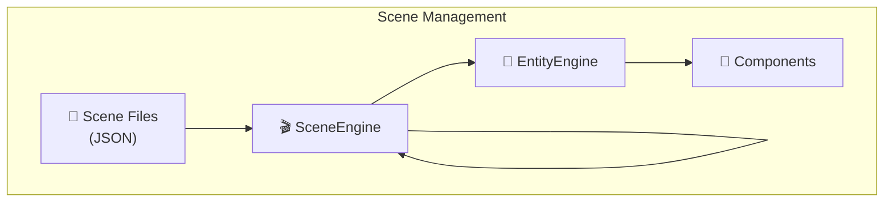
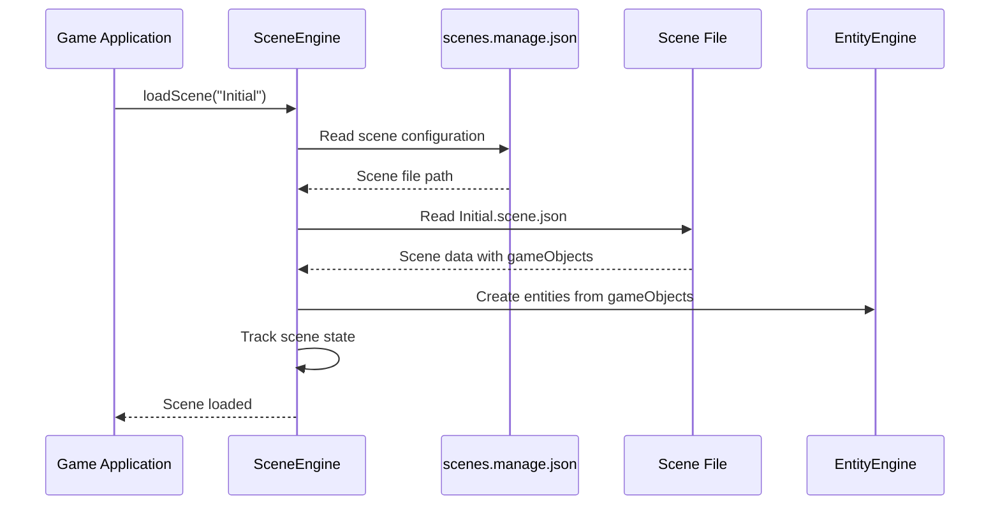

# SceneEngine

The SceneEngine manages scene loading, transitions, and coordination of game states. It handles loading scene definitions from JSON files and orchestrating the creation of entities and components within scenes.

## Purpose

The SceneEngine is responsible for:
- **Scene loading**: Loading scene definitions from project files
- **Scene transitions**: Managing smooth transitions between different game scenes
- **Entity coordination**: Creating entities and components based on scene data
- **Asset management**: Coordinating asset loading for scene requirements
- **Scene lifecycle**: Managing scene initialization, activation, and cleanup

## Architecture Role



## Public Methods

### Scene Lifecycle
```typescript
constructor(options: SceneEngineOptions)
```
Creates SceneEngine with project path and engine dependencies.

```typescript
async setup(): Promise<void>
```
Initializes the scene management system.

### Scene Management
```typescript
async loadScene(sceneName: string): Promise<void>
```
Loads a scene by name from the project's scene files.

```typescript
getCurrentScene(): Scene | null
```
Returns the currently active scene instance.

```typescript
async transitionToScene(sceneName: string, transitionType?: string): Promise<void>
```
Performs a scene transition with optional transition effects.

### Scene Data
```typescript
getSceneData(sceneName: string): SceneData | null
```
Retrieves scene data without loading the scene.

```typescript
getAvailableScenes(): string[]
```
Returns list of available scene names from the project.

### Scene State
```typescript
pauseCurrentScene(): void
```
Pauses the current scene (disables systems, stops updates).

```typescript
resumeCurrentScene(): void
```
Resumes a paused scene.

```typescript
clearCurrentScene(): void
```
Clears all entities and components from the current scene.

## Interaction with Other Engines

### With EntityEngine
SceneEngine uses EntityEngine to create scene entities:

```typescript
async loadScene(sceneName: string): Promise<void> {
  const sceneData = await this.loadSceneData(sceneName);
  
  // Create entities from scene data
  for (const entityData of sceneData.entities) {
    const entityId = this.engine.EntityEngine.createEntity(entityData.components);
    this.currentSceneEntities.add(entityId);
  }
  
  // Emit scene loaded event
  this.eventEngine.emit('scene:loaded', { sceneName, sceneData });
}
```

### With SystemEngine
SceneEngine coordinates with SystemEngine for scene-specific systems:

```typescript
// Enable only systems required for the current scene
this.engine.SystemEngine.setupScene(sceneData.systems);

// Scene transitions may enable/disable different systems
this.engine.SystemEngine.clear(); // Disable custom systems
```

### With EventEngine
SceneEngine emits scene lifecycle events:

```typescript
// Scene events emitted by SceneEngine
this.eventEngine.emit('scene:loading', { sceneName });
this.eventEngine.emit('scene:loaded', { sceneName, sceneData });
this.eventEngine.emit('scene:transition:start', { fromScene, toScene });
this.eventEngine.emit('scene:transition:end', { sceneName });
```

## Scene File Structure

### Scene Management Configuration
Scenes are managed through `scenes.manage.json` which defines available scenes and the initial scene:

```json
{
  "initialScene": "Initial",
  "scenes": {
    "Initial": "Initial.scene.json"
  }
}
```

### Scene Definition Format
Individual scene files contain game object definitions:

```json
{
  "name": "Initial",
  "path": "Initial.scene.json",
  "systems": [],
  "gameObjects": [
    {
      "name": "Bunny",
      "blueprint": {
        "name": "Bunny",
        "path": "Bunny.blueprint.json"
      },
      "components": [
        {
          "name": "SpriteComponent",
          "data": {
            "texture_path": "bunny.png",
            "position": { "x": 400, "y": 300 },
            "scale": { "x": 1, "y": 1 },
            "rotation": 0,
            "alpha": 1,
            "visible": true,
            "anchor": 0.5
          }
        },
        {
          "name": "MouseComponent",
          "data": {
            "screenPosition": { "x": 0, "y": 0 },
            "windowPosition": { "x": 0, "y": 0 },
            "buttons": {
              "left": false,
              "right": false,
              "middle": false
            },
            "wheel": {
              "deltaX": 0,
              "deltaY": 0,
              "deltaZ": 0
            }
          }
        }
      ]
    }
  ]
}
```

### Initial Scene Loading
The game always starts by loading the scene specified in `scenes.manage.json` as `initialScene`:

```json
{
  "initialScene": "Initial",  // This scene loads when the game starts
  "scenes": {
    "Initial": "Initial.scene.json"  // Maps scene name to file path
  }
}
```

### Scene Loading Process


## Scene Management

### Scene Transitions
SceneEngine handles transitions between scenes:

```typescript
async transitionToScene(newSceneName: string): Promise<void> {
  // Emit transition start
  this.eventEngine.emit('scene:transition:start', {
    fromScene: this.currentScene?.name,
    toScene: newSceneName
  });
  
  // Clear current scene
  this.clearCurrentScene();
  
  // Load new scene
  await this.loadScene(newSceneName);
  
  // Emit transition complete
  this.eventEngine.emit('scene:transition:end', {
    sceneName: newSceneName
  });
}
```

### Game Object Management
SceneEngine creates entities from gameObjects defined in scene files:

```typescript
// Create entities from scene gameObjects
for (const gameObjectData of sceneData.gameObjects) {
  const entityId = this.engine.EntityEngine.createEntity(gameObjectData.components);
  this.currentSceneEntities.add(entityId);
}

// Track scene entities for cleanup
private currentSceneEntities: Set<string> = new Set();

// Clean up scene entities
clearCurrentScene(): void {
  for (const entityId of this.currentSceneEntities) {
    this.engine.EntityEngine.removeEntity(entityId);
  }
  this.currentSceneEntities.clear();
}
```

## Scene Configuration

### SceneEngine Options
```typescript
interface SceneEngineOptions {
  projectPath: string;          // Path to project scene files
  engine: TypeEngine;           // Main engine reference
  EventEngine: EventEngine;     // Event system reference
}
```

### Project Scene Structure
```
project-folder/
├── scenes.manage.json       # Scene configuration and initial scene
├── Initial.scene.json       # Initial scene file
└── other-scene.scene.json   # Additional scene files
```

## Usage Examples

### Basic Scene Loading
```typescript
// Game starts by automatically loading the initialScene from scenes.manage.json
// Load a specific scene by name
await engine.SceneEngine.loadScene('Initial');

// Get current scene
const currentScene = engine.SceneEngine.getCurrentScene();
```

### Scene Transitions in Game
```typescript
class GameManager {
  async startGame() {
    // Initial scene is loaded automatically when engine starts
    // based on scenes.manage.json configuration
  }
  
  async playLevel(levelName: string) {
    await this.engine.SceneEngine.transitionToScene(levelName);
  }
  
  async gameOver() {
    await this.engine.SceneEngine.transitionToScene('game-over');
  }
}
```

### Event-Driven Scene Management
```typescript
class SceneTransitionSystem implements System<TypeEngine> {
  async init(engine: TypeEngine): Promise<void> {
    engine.EventEngine.on('player:reached-exit', async (data) => {
      await engine.SceneEngine.transitionToScene(data.nextLevel);
    });
    
    engine.EventEngine.on('player:died', async () => {
      await engine.SceneEngine.transitionToScene('game-over');
    });
  }
}
```

## Performance Considerations

### Scene Loading Optimization
- **Async Loading**: Non-blocking scene loading with progress callbacks
- **Entity Batching**: Efficient batch creation of scene entities from gameObjects
- **Component Creation**: Streamlined component instantiation from scene data

### Memory Management
- **Scene Cleanup**: Proper cleanup of entities and components on scene change
- **Entity Tracking**: Track all entities created from gameObjects for cleanup
- **System Management**: Enable/disable systems based on scene requirements

### Transition Performance
```typescript
// Optimized scene transitions
async transitionToScene(newScene: string): Promise<void> {
  // 1. Quick cleanup of current scene
  this.clearCurrentScene();
  
  // 2. Load new scene with gameObjects
  await this.loadScene(newScene);
}
```

## Integration Patterns

### Dynamic Scene Creation
```typescript
// Create scenes programmatically
const dynamicScene = {
  name: 'generated-level',
  path: 'generated-level.scene.json',
  systems: ['PhysicsSystem', 'RenderPixiSystem'],
  gameObjects: this.generateLevelGameObjects()
};

await engine.SceneEngine.loadSceneFromData(dynamicScene);
```

### Scene State Persistence
```typescript
// Save/load scene state
class SaveSystem {
  saveScene(): SceneState {
    return {
      sceneName: engine.SceneEngine.getCurrentScene()?.name,
      gameObjectStates: this.captureGameObjectStates()
    };
  }
  
  async loadScene(saveData: SceneState): Promise<void> {
    await engine.SceneEngine.loadScene(saveData.sceneName);
    this.restoreGameObjectStates(saveData.gameObjectStates);
  }
}
```

## Notes

- SceneEngine provides high-level scene management for game organization
- Coordinates between multiple engines for complete scene setup
- Handles asset loading and entity creation from scene definitions
- Manages scene transitions and lifecycle events
- Essential for organizing game content and managing game state
- Integrates with all other engines through entity creation and event coordination