# SystemEngine

The SystemEngine manages the lifecycle and execution of all systems in the ECS architecture. It handles system registration, loading, prioritization, and coordinates the system update cycle.

## Purpose

The SystemEngine is responsible for:
- **System management**: Loading, registering, and managing system lifecycle
- **Execution coordination**: Running systems in priority order during updates
- **System lifecycle**: Initializing, updating, and cleaning up systems
- **Custom system loading**: Loading custom systems from project configuration
- **System state control**: Enabling, disabling, and toggling systems

## Architecture Role

```mermaid
graph TB
    subgraph "System Management"
        Config["📄 system.manage.json"]
        SE["⚙️ SystemEngine"]
        DefaultSys["🔧 Default Systems"]
        CustomSys["🛠️ Custom Systems"]
    end
    
    subgraph "System Execution"
        Update["🔄 Update Loop"]
        Priority["📊 Priority Order"]
        Systems["⚙️ Active Systems"]
    end
    
    Config --> SE
    DefaultSys --> SE
    CustomSys --> SE
    SE --> Update
    Update --> Priority
    Priority --> Systems
```



## Public Methods

### System Lifecycle
```typescript
constructor(options: SystemEngineOptions)
```
Creates SystemEngine with project path and engine dependencies.

```typescript
async setup(): Promise<void>
```
Initializes default systems, loads custom systems, and sets up execution order.

### System Management
```typescript
getSystem(name: string): System<TypeEngine> | undefined
```
Retrieves a specific system by name.

```typescript
getAll(): System<TypeEngine>[]
```
Returns all registered systems.

```typescript
getEnabled(): System<TypeEngine>[]
```
Returns only currently enabled systems.

### System Control
```typescript
toggle(name: string): void
```
Toggles the enabled state of a system by name.

```typescript
setupScene(systemNames: string[]): void
```
Enables only the specified systems for a scene.

```typescript
clear(): void
```
Disables all non-default (custom) systems.

### System Execution
```typescript
update(deltaTime: number): void
```
Updates all enabled systems in priority order.

## Interaction with Other Engines

### With TypeEngine
SystemEngine is called by TypeEngine during the main update loop:

```typescript
class TypeEngine {
  update(deltaTime: number): void {
    // SystemEngine coordinates all system updates
    this.SystemEngine.update(deltaTime);
  }
}
```

### With EntityEngine
Systems use EntityEngine to query for entities with required components:

```typescript
class ExampleSystem implements System<TypeEngine> {
  update(engine: TypeEngine, deltaTime: number): void {
    // Systems query EntityEngine for relevant entities
    const entities = engine.EntityEngine.query(['ComponentA', 'ComponentB']);
    
    // Process entities
    for (const { components } of entities) {
      // System logic here
    }
  }
}
```

### With EventEngine
SystemEngine emits system lifecycle events:

```typescript
// Events emitted during system updates
this.EventEngine.emit('system:update:start', system, deltaTime);
system.update(this.engine, deltaTime);
this.EventEngine.emit('system:update:end', system, deltaTime);
```

## Default Systems

### Built-in Systems
SystemEngine automatically loads default engine systems:

```typescript
// Default systems loaded on setup
const physicsSystem = new PhysicsSystem();       // Priority 1
const renderSystem = new RenderPixiSystem();     // Priority 2  
const mouseSystem = new MouseSystem();           // Priority 1
```

### System Priorities
Systems execute in priority order (lower numbers = higher priority):

| System | Priority | Purpose |
|--------|----------|---------|
| PhysicsSystem | 1 | Physics simulation and collision |
| MouseSystem | 1 | Input capture and processing |
| RenderPixiSystem | 2 | Visual rendering and display |
| Custom Systems | Varies | Game-specific logic |

## Custom System Loading

### System Configuration
Custom systems are defined in `system.manage.json`:

```json
{
  "PlayerMovementSystem": "./PlayerMovementSystem.system.js",
  "EnemyAISystem": "./EnemyAISystem.system.js",
  "ScoreSystem": "./ScoreSystem.system.js"
}
```

### System Loading Process


### System Loading Implementation
```typescript
private async loadCustomSystem(systemName: string, systemPath: string): Promise<void> {
  try {
    // Load system module dynamically
    const absolute = await window.electronAPI.absolutePath(
      `${this.engine.projectPath}/${systemPath}`
    );
    const systemModule = await import(absolute);
    
    // Create system instance
    const SystemModule = systemModule.default || systemModule[systemName];
    const system = new SystemModule();
    
    // Register system
    this.add(systemName, system);
  } catch (error) {
    console.warn(`Failed to load system ${systemName}:`, error);
  }
}
```

## System Execution Model

### Update Cycle
SystemEngine coordinates system updates in priority order:

```typescript
update(deltaTime: number): void {
  for (const system of this.systems.values()) {
    if (system.enabled) {
      // Emit system start event
      this.EventEngine.emit("system:update:start", system, deltaTime);
      
      // Update system
      system.update(this.engine, deltaTime);
      
      // Emit system end event
      this.EventEngine.emit("system:update:end", system, deltaTime);
    }
  }
}
```

### Priority-Based Execution
Systems are sorted by priority during setup:

```typescript
async setup(): Promise<void> {
  this.addDefaultSystems();
  await this.loadSystemsFromConfig();
  await this.setupSystems();
  
  // Sort systems by priority (lower = higher priority)
  this.systemsList.sort((a, b) => a.priority - b.priority);
}
```

## System State Management

### Scene-Based System Control
SystemEngine manages system state for different scenes:

```typescript
setupScene(systemNames: string[]): void {
  // Enable only systems required for the current scene
  for (const systemName of systemNames) {
    const system = this.systems.get(systemName);
    if (system) {
      system.enabled = true;
    }
  }
}

clear(): void {
  // Disable all non-default systems
  const nonDefaultSystems = this.systemsList.filter(
    s => !this.systemsDefault.includes(s.name)
  );
  nonDefaultSystems.forEach(s => {
    s.enabled = false;
  });
}
```

### Dynamic System Control
```typescript
// Toggle systems at runtime
engine.SystemEngine.toggle('EnemyAISystem');      // Disable enemy AI
engine.SystemEngine.toggle('PhysicsSystem');      // Pause physics
engine.SystemEngine.toggle('RenderPixiSystem');   // Hide visuals
```

## System Configuration

### SystemEngine Options
```typescript
interface SystemEngineOptions {
  projectPath: string;          // Path to project system files
  EventEngine: EventEngine;     // Event system reference
  engine: TypeEngine;           // Main engine reference
}
```

### System Interface Requirements
All systems must implement the System interface:

```typescript
interface System<TEngine> {
  name: string;                 // Unique system identifier
  priority: number;             // Execution priority (lower = earlier)
  enabled: boolean;             // Whether system should update
  
  init(engine: TEngine): void | Promise<void>;     // Initialization
  update(engine: TEngine, deltaTime: number): void; // Update logic
  destroy?(engine: TEngine): void;                 // Cleanup
}
```

## Usage Examples

### System Registration
```typescript
// Custom system implementation
class PlayerMovementSystem implements System<TypeEngine> {
  name = "PlayerMovementSystem";
  priority = 1;  // High priority for input processing
  enabled = true;

  async init(engine: TypeEngine): Promise<void> {
    // System initialization
  }

  update(engine: TypeEngine, deltaTime: number): void {
    // Query for player entities
    const players = engine.EntityEngine.query(['PlayerComponent', 'TransformComponent']);
    
    // Update player movement
    for (const { components } of players) {
      // Movement logic here
    }
  }
}
```

### Scene System Management
```typescript
// Different systems for different scenes
const menuSystems = ['MouseSystem', 'RenderPixiSystem', 'UISystem'];
const gameplaySystems = ['PhysicsSystem', 'RenderPixiSystem', 'PlayerMovementSystem', 'EnemyAISystem'];
const pauseSystems = ['RenderPixiSystem', 'UISystem'];

// Switch system sets based on game state
engine.SystemEngine.clear();
engine.SystemEngine.setupScene(gameplaySystems);
```

### System Monitoring
```typescript
// Monitor system performance
engine.EventEngine.on('system:update:start', (system, deltaTime) => {
  console.time(`${system.name}-update`);
});

engine.EventEngine.on('system:update:end', (system, deltaTime) => {
  console.timeEnd(`${system.name}-update`);
});
```

## Performance Considerations

### System Ordering
- **Input Systems**: Priority 1 (capture input early)
- **Game Logic**: Priority 1-3 (process game state)
- **Physics**: Priority 1 (before rendering)
- **Rendering**: Priority 2+ (after all logic updates)

### System Optimization
- **Selective Enablement**: Only enable systems needed for current scene
- **Priority Optimization**: Order systems for optimal data flow
- **Batch Processing**: Systems can process multiple entities efficiently

### Update Scheduling
```typescript
// Efficient system update pattern
update(deltaTime: number): void {
  // Systems execute in priority order
  // Each system processes all relevant entities in batch
  // Minimal overhead between system updates
}
```

## Integration Patterns

### Custom System Development
```typescript
// Create custom system file: EnemyAISystem.system.ts
export class EnemyAISystem implements System<TypeEngine> {
  name = "EnemyAISystem";
  priority = 2;  // After input, before rendering
  enabled = true;

  update(engine: TypeEngine, deltaTime: number): void {
    const enemies = engine.EntityEngine.query(['EnemyComponent', 'AIComponent']);
    
    for (const { components } of enemies) {
      this.updateEnemyAI(components.EnemyComponent[0], components.AIComponent[0], deltaTime);
    }
  }
}

// Register in system.manage.json:
// { "EnemyAISystem": "./EnemyAISystem.system.js" }
```

### System Communication
```typescript
// Systems communicate through components and events
class HealthSystem implements System<TypeEngine> {
  update(engine: TypeEngine, deltaTime: number): void {
    const entities = engine.EntityEngine.query(['HealthComponent']);
    
    for (const { entityId, components } of entities) {
      const health = components.HealthComponent[0];
      
      if (health.current <= 0) {
        // Emit event for other systems
        engine.EventEngine.emit('entity:died', { entityId });
      }
    }
  }
}
```

## Notes

- SystemEngine is the execution coordinator for all ECS systems
- Manages both default engine systems and custom game systems
- Provides flexible system state control for different game scenes
- Handles system loading, initialization, and cleanup automatically
- Essential for maintaining proper ECS execution order and performance
- Coordinates with all other engines through system update cycle