# TimeEngine

The TimeEngine manages timed function execution with both variable and fixed timestep capabilities. It provides a centralized update loop system for registering functions that need to be called repeatedly with delta time.

## Purpose

The TimeEngine is responsible for:
- **Function registration**: Managing functions that need timed updates
- **Variable timestep updates**: Calling functions with actual frame delta time
- **Fixed timestep updates**: Calling functions at consistent intervals using accumulator pattern
- **Update loop management**: Starting, stopping, and coordinating the timing loop
- **Delta time calculation**: Computing time elapsed between frames

## Architecture Role

```mermaid
graph TB
    subgraph "TimeEngine Function Management"
        Browser["🌐 Browser<br/>requestAnimationFrame"]
        TE["⏰ TimeEngine<br/>Update Loop"]
        VarFunc["📈 Variable Timestep<br/>Functions"]
        FixedFunc["⏱️ Fixed Timestep<br/>Functions"]
    end
    
    Browser --> TE
    TE --> VarFunc
    TE --> FixedFunc
    VarFunc --> TE
    FixedFunc --> TE
```



## Public Methods

### Function Registration
```typescript
add(func: (deltaTime: number) => void): void
```
Adds a function to be called on each update with variable deltaTime.

```typescript
remove(func: (deltaTime: number) => void): void
```
Removes a function from the variable timestep update loop.

```typescript
addFixed(func: (fixedDeltaTime: number) => void): void
```
Adds a function to be called at fixed intervals using accumulator pattern.

```typescript
removeFixed(func: (fixedDeltaTime: number) => void): void
```
Removes a function from the fixed timestep update loop.

### Engine Control
```typescript
start(): void
```
Starts the TimeEngine update loop using requestAnimationFrame.

```typescript
stop(): void
```
Stops the TimeEngine update loop and cancels animation frame.

```typescript
clear(): void
```
Clears all registered functions (both variable and fixed timestep).

### Engine State
```typescript
getIsRunning(): boolean
```
Returns whether the TimeEngine is currently running.

```typescript
getFunctionCount(): number
```
Returns the number of registered variable timestep functions.

```typescript
getFixedFunctionCount(): number
```
Returns the number of registered fixed timestep functions.

```typescript
getFixedTimeStep(): number
```
Returns the current fixed timestep duration in milliseconds.

## Interaction with Other Engines

### Function-Based Integration
TimeEngine doesn't directly integrate with other engines. Instead, other engines register functions with TimeEngine:

```typescript
class TypeEngine {
  async setup(): Promise<void> {
    // Register the main update function with TimeEngine
    this.TimeEngine.add((deltaTime: number) => {
      this.update(deltaTime);
    });
    
    // Start the TimeEngine loop
    this.TimeEngine.start();
  }
  
  update(deltaTime: number): void {
    // Process events and update systems
    this.EventEngine.processEvents();
    this.SystemEngine.update(deltaTime);
  }
}
```

### Physics Integration
Physics systems that need consistent timesteps can use fixed timestep functions:

```typescript
// Register physics update for fixed timestep
engine.TimeEngine.addFixed((fixedDeltaTime: number) => {
  engine.PhysicsEngine.update(fixedDeltaTime);
});
```

### System Registration
Individual systems can register directly with TimeEngine:

```typescript
class AnimationSystem implements System<TypeEngine> {
  async init(engine: TypeEngine): Promise<void> {
    // Register animation update function
    engine.TimeEngine.add((deltaTime: number) => {
      this.updateAnimations(deltaTime);
    });
  }
}
```

## Update Loop Implementation

### Variable Timestep Updates
TimeEngine calculates delta time and calls variable timestep functions:

```typescript
private updateLoop = (): void => {
  if (!this.isRunning) return;

  const currentTime = performance.now();
  const deltaTime = currentTime - this.lastTime;
  this.lastTime = currentTime;

  // Call all variable timestep functions with actual deltaTime
  for (const func of this.functions) {
    try {
      func(deltaTime);
    } catch (error) {
      console.warn("Error in TimeEngine function:", error);
    }
  }

  // Handle fixed timestep functions...
  this.handleFixedTimestep(deltaTime);

  // Schedule next frame
  this.animationFrameId = requestAnimationFrame(this.updateLoop);
};
```

### Fixed Timestep with Accumulator Pattern
TimeEngine uses accumulator pattern for consistent fixed timestep updates:

```typescript
// Handle fixed timestep functions with accumulator pattern
this.fixedAccumulator += deltaTime;

while (this.fixedAccumulator >= this.fixedTimeStep) {
  // Call all fixed timestep functions with fixed deltaTime
  for (const func of this.fixedFunctions) {
    try {
      func(this.fixedTimeStep);
    } catch (error) {
      console.warn("Error in TimeEngine fixed function:", error);
    }
  }
  
  this.fixedAccumulator -= this.fixedTimeStep;
}
```

## Configuration

### TimeEngine Options
```typescript
interface TimeEngineOptions {
  fixedFps?: number;    // Target FPS for fixed timestep (default: 60)
}
```

### Fixed Timestep Configuration
```typescript
// Create TimeEngine with 30 FPS fixed timestep
const timeEngine = new TimeEngine({ fixedFps: 30 });

// Default 60 FPS fixed timestep
const timeEngine = new TimeEngine();
```

The fixed timestep is calculated as: `1000 / fixedFps` milliseconds.

## Usage Examples

### Basic Function Registration
```typescript
// Register a variable timestep function
const updateGame = (deltaTime: number) => {
  console.log(`Frame took ${deltaTime}ms`);
};

engine.TimeEngine.add(updateGame);

// Register a fixed timestep function
const updatePhysics = (fixedDeltaTime: number) => {
  console.log(`Physics step: ${fixedDeltaTime}ms`);
};

engine.TimeEngine.addFixed(updatePhysics);

// Start the engine
engine.TimeEngine.start();
```

### Engine Integration
```typescript
class GameEngine {
  private timeEngine: TimeEngine;
  
  constructor() {
    this.timeEngine = new TimeEngine({ fixedFps: 60 });
    
    // Register main update function
    this.timeEngine.add((deltaTime: number) => {
      this.update(deltaTime);
    });
    
    // Register physics update for consistent timestep
    this.timeEngine.addFixed((fixedDeltaTime: number) => {
      this.updatePhysics(fixedDeltaTime);
    });
  }
  
  start(): void {
    this.timeEngine.start();
  }
  
  stop(): void {
    this.timeEngine.stop();
  }
}
```

## Timestep Comparison

### Variable Timestep vs Fixed Timestep

**Variable Timestep Functions** (`add()`):
- Receive actual frame delta time
- Good for rendering, input, UI updates
- Frame-rate dependent behavior
- May have inconsistent timing

**Fixed Timestep Functions** (`addFixed()`):
- Receive consistent fixed delta time
- Essential for physics simulation
- Frame-rate independent behavior  
- Uses accumulator pattern for stability

### When to Use Each

```typescript
// Variable timestep - for rendering and input
engine.TimeEngine.add((deltaTime) => {
  updateInput(deltaTime);
  updateAnimations(deltaTime);
  render();
});

// Fixed timestep - for physics and game logic
engine.TimeEngine.addFixed((fixedDelta) => {
  updatePhysics(fixedDelta);
  updateGameLogic(fixedDelta);
});
```

## Performance Considerations

### Function Management
- **Error Isolation**: Function errors don't stop the update loop
- **Efficient Iteration**: Direct array iteration for performance
- **Memory Management**: Functions can be added/removed dynamically

### RequestAnimationFrame
- **Browser Optimized**: Uses browser's optimal timing
- **Tab Handling**: Automatically pauses when tab is inactive
- **VSync Coordination**: Synchronizes with display refresh rate

## Notes

- TimeEngine provides a function-based update loop system
- Supports both variable and fixed timestep updates for different use cases
- Uses accumulator pattern for stable fixed timestep physics
- Essential for coordinating timing across the entire engine
- Functions are registered and managed dynamically
- Critical for maintaining consistent game timing and behavior