# TypeEngine

The TypeEngine serves as the central coordinator and main entry point for the entire game engine. It manages all sub-engines through dependency injection and orchestrates the game loop.

## Purpose

The TypeEngine acts as the **central coordinator** that:
- **Orchestrates sub-engines**: Manages lifecycle of all specialized engines
- **Coordinates game loop**: Handles the main update cycle and timing
- **Manages dependency injection**: Provides sub-engines with their required dependencies
- **Handles scene transitions**: Coordinates scene loading and switching
- **Provides unified interface**: Single entry point for game initialization and control

## Architecture Role

```mermaid
graph LR
    subgraph "Game Application"
        APP["🎮 Game Application"]
    end
    
    subgraph "TypeEngine - Central Coordinator"
        TE["🎛️ TypeEngine<br/>Main Orchestrator"]
    end
    
    subgraph "Sub-Engines"
        EE["👥 EntityEngine"]
        RE["🖼️ RenderEngine"]
        PE["⚡ PhysicsEngine"]
        ScE["🎬 SceneEngine"]
        SysE["⚙️ SystemEngine"]
        EvE["📡 EventEngine"]
        TiE["⏰ TimeEngine"]
    end
    
    APP --> TE
    TE --> EE
    TE --> RE
    TE --> PE
    TE --> ScE
    TE --> SysE
    TE --> EvE
    TE --> TiE
```



## Public Methods

### Initialization
```typescript
constructor(options: TypeEngineOptions)
```
Creates TypeEngine instance with configuration options including project path, rendering settings, and physics configuration.

### Engine Lifecycle
```typescript
async setup(): Promise<void>
```
Initializes all sub-engines and prepares the engine for operation. Must be called before starting the game loop.

```typescript
async start(): Promise<void>
```
Starts the main game loop and begins engine operation.

```typescript
stop(): void
```
Stops the game loop and engine operation.

### Scene Management
```typescript
async loadScene(sceneName: string): Promise<void>
```
Loads and transitions to a specified scene by name.

```typescript
getCurrentScene(): Scene | null
```
Returns the currently active scene.

### Update Loop
```typescript
update(deltaTime: number): void
```
Main update method called each frame. Coordinates updates across all sub-engines in proper order.

### Engine Access
```typescript
getEngine<T>(engineName: string): T
```
Provides access to specific sub-engines for advanced usage.

## Interaction with Sub-Engines

### Dependency Injection
The TypeEngine creates and injects dependencies for all sub-engines:

```typescript
// Example of dependency injection
const entityEngine = new EntityEngine({
  engine: this,           // Reference to TypeEngine
  EventEngine: this.EventEngine
});

const renderEngine = new RenderEngine({
  engine: this,
  EventEngine: this.EventEngine,
  width: options.render.width,
  height: options.render.height
});
```

### Update Coordination
TypeEngine coordinates the update cycle across all sub-engines:

1. **TimeEngine**: Calculates delta time
2. **SystemEngine**: Updates all game systems
3. **PhysicsEngine**: Updates physics simulation (via PhysicsSystem)
4. **RenderEngine**: Renders visual updates (via RenderPixiSystem)
5. **EventEngine**: Processes queued events

### Event Communication
All sub-engines communicate through the EventEngine, which TypeEngine manages:

```typescript
// Sub-engines emit events
this.EventEngine.emit('entity:created', entityData);

// Other sub-engines listen for events
this.EventEngine.on('entity:created', this.handleEntityCreated);
```

## Configuration

### TypeEngine Options
```typescript
interface TypeEngineOptions {
  projectPath: string;           // Path to game project files
  render: {
    width: number;              // Render window width
    height: number;             // Render window height
    htmlTagId?: string;         // HTML element ID for rendering
  };
  physics?: {
    gravity?: {                 // Physics world gravity
      x: number;
      y: number;
    };
  };
}
```

### Usage Example
```typescript
const engine = new TypeEngine({
  projectPath: './game-project',
  render: {
    width: 1024,
    height: 768,
    htmlTagId: 'game-canvas'
  },
  physics: {
    gravity: { x: 0, y: 0.8 }
  }
});

await engine.setup();
await engine.start();
```

## Game Loop Coordination

The TypeEngine manages the main game loop:


## Performance Considerations

### Efficient Coordination
- **Single Update Call**: Coordinates all sub-engines through single update cycle
- **Dependency Injection**: Eliminates singleton patterns and global state
- **Event-Driven**: Reduces coupling between sub-engines through events

### Resource Management
- **Centralized Initialization**: All sub-engines initialized together
- **Proper Cleanup**: Handles cleanup of all sub-engines on shutdown
- **Memory Efficiency**: Manages object lifecycle across the entire engine

## Integration Patterns

### Game Application Integration
```typescript
class Game {
  private engine: TypeEngine;
  
  async initialize() {
    this.engine = new TypeEngine({
      projectPath: './assets',
      render: { width: 800, height: 600 }
    });
    
    await this.engine.setup();
    await this.engine.start();
  }
  
  async loadLevel(levelName: string) {
    await this.engine.loadScene(levelName);
  }
}
```

### Custom System Integration
```typescript
// TypeEngine automatically loads and manages custom systems
// through SystemEngine based on system.manage.json configuration
```

## Notes

- TypeEngine is the single entry point for the entire game engine
- All sub-engines receive TypeEngine reference for coordination
- Manages the complete engine lifecycle from initialization to shutdown
- Provides unified interface while maintaining separation of concerns
- Handles cross-engine communication through EventEngine
- Essential for proper dependency injection and engine coordination