# Build System

The TYPE Game Engine is built on top of Electron, providing a desktop application that combines game development tools with runtime execution.

## Electron Integration

### Current Electron Architecture

```mermaid
graph TB
    subgraph "Electron Application"
        Main["🔧 Main Process<br/>App lifecycle<br/>File system"]
        Preload["🔒 Preload Script<br/>IPC bridge"]
        
        subgraph "Renderer Processes"
            Game["🎮 Game Renderer<br/>src/renderer/game<br/>TypeEngine runtime"]
            Editor["⚙️ Editor Renderer<br/>src/renderer/editor<br/>(Future)"]
        end
    end
    
    Main --> Preload
    Preload --> Game
    Preload --> Editor
    Main -.-> Editor
    Main --> Game
```

### Game Runtime Process
The game renderer is where the TYPE engine executes:

### Future Editor Integration
A React-based editor is planned for integration with the engine:

```mermaid
graph LR
    subgraph "Development Workflow"
        Editor["⚙️ React Editor<br/>Scene editing<br/>Asset management"]
        Files["📁 Project Files<br/>JSON data<br/>Components"]
        Game["🎮 Game Runtime<br/>Live preview<br/>Testing"]
    end
    
    Editor --> Files
    Files --> Game
    Game -.-> Editor
    Editor -.-> Game
```

## Build Process
The TYPE engine uses a dual-configuration build system with Electron and Vite:

### Configuration Flow

### Build Process Details

**electron.vite.config.ts responsibilities:**
- Sets up Electron main process compilation
- Configures preload script with security policies
- Prepares renderer process shells
- Manages Electron-specific optimizations
- Coordinates the overall build pipeline

**vite.config.ts responsibilities:**
- Bundles TypeEngine and sub-engines
- Processes game components and systems
- Handles asset optimization and loading
- Creates game runtime bundle for interpretation

**Integration flow:**
1. **electron.vite.config.ts** runs first to establish Electron core
2. Core setup triggers **vite.config.ts** for game file processing
3. Game files are bundled and made available to Electron core
4. Electron core interprets and executes the game bundle

## File System Integration
Electron provides secure file system access for project management:

```mermaid
graph TB
    subgraph "File System Access"
        Main["🔧 Main Process<br/>File operations<br/>Directory watching<br/>Asset loading"]
        
        subgraph "Project Structure"
            Scenes["📋 Scene Files<br/>.scene.json"]
            Blueprints["📐 Blueprint Files<br/>.blueprint.json"]
            Components["🔧 Component Files<br/>.component.js"]
            Assets["🖼️ Asset Files<br/>Images, sounds"]
        end
        
        subgraph "Renderers"
            GameR["🎮 Game Renderer"]
            EditorR["⚙️ Editor Renderer"]
        end
    end
    
    Main --> Scenes
    Main --> Blueprints
    Main --> Components
    Main --> Assets
    
    Scenes --> GameR
    Blueprints --> GameR
    Components --> GameR
    Assets --> GameR
    
    Scenes -.-> EditorR
    Blueprints -.-> EditorR
    Components -.-> EditorR
    Assets -.-> EditorR
```

## Available Build Commands

| Command | Description |
|---------|-------------|
| `pnpm dev` | Start development mode with hot reloading |
| `pnpm build` | Build application for production |
| `pnpm build:linux` | Build Linux distributables |
| `pnpm build:mac` | Build macOS distributables |
| `pnpm build:win` | Build Windows distributables |

## Development vs Production

### Development Mode
- Hot reloading for both main and renderer processes
- Source maps for debugging
- Unoptimized bundles for faster compilation
- Development server for asset serving

### Production Build
- Optimized and minified bundles
- Asset optimization and compression
- Code splitting for better performance
- Platform-specific packaging

---

::: tip Build Performance
The dual-configuration system allows for optimal build performance by separating Electron core concerns from game logic bundling, enabling independent optimization strategies.
:::

::: warning Security
The build process maintains Electron security best practices with context isolation and secure preload scripts to prevent security vulnerabilities.
:::