## What is Type?

**Type** _(TypeScript Yields Powerful [Game] Engines)_ is a modern game engine that implements Entity Component System (ECS) architecture with a sophisticated multi-engine design pattern. Built for high-performance 2D game development, Type provides a complete ecosystem for creating games with TypeScript.

### Key Features

- **🎛️ TypeEngine Coordinator**: Central engine that manages all sub-engines through dependency injection
- **👥 Entity Management**: Comprehensive ECS system with component lifecycle management
- **🖼️ Render Engine**: Pure PIXI.js integration for efficient sprite management
- **⚡ Physics Engine**: Matter.js integration with automatic body-sprite synchronization
- **⚙️ System Engine**: Priority-based system execution with hot-swappable logic
- **📡 Event Engine**: Decoupled communication between engine components
- **⏰ Time Engine**: Precise frame timing and delta calculation

### Architecture Overview

Type is built around a **multi-engine architecture** where the TypeEngine serves as a central coordinator, managing 7 specialized sub-engines:

```mermaid
graph TB
    TE["🎛️ TypeEngine<br/>Central Coordinator"]
    
    TE --> EE["👥 EntityEngine"]
    TE --> RE["🖼️ RenderEngine"]
    TE --> PE["⚡ PhysicsEngine"]
    TE --> ScE["🎬 SceneEngine"]
    TE --> SysE["⚙️ SystemEngine"]
    TE --> EvE["📡 EventEngine"]
    TE --> TiE["⏰ TimeEngine"]
```



### Why Choose Type?

- **🏆 Academic Grade**: Developed as part of MBA Software Engineering program at USP Brazil
- **🔒 Security First**: Electron security best practices with context isolation
- **🧪 Test-Driven**: Comprehensive test coverage following TDD principles
- **📚 Well Documented**: Extensive documentation with architectural decisions
- **🎯 Performance Focused**: ECS architecture optimized for game loops

### Quick Example

```typescript
// Create and setup the engine
const engine = new TypeEngine({
  projectPath: './game-assets',
  Render: { 
    canvas: document.getElementById('game-canvas'),
    width: 1024,
    height: 768 
  },
  Physics: { 
    gravity: { x: 0, y: 0.8 } 
  }
});

// Setup all sub-engines
await engine.setup();

// Start the game loop
engine.start();
```

---

<div class="tip custom-block" style="margin-top: 2rem;">
  <p class="custom-block-title">🎓 Academic Project</p>
  <p>This project is part of an academic research program at <strong>Universidade de São Paulo (USP)</strong> Brazil, focusing on modern software architecture and ECS game engine design patterns.</p>
</div>
